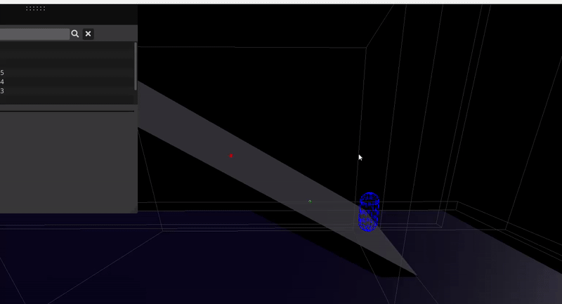

# Weapon Systems, Physics & Gameplay Programming - Custom C++ FPS Engine

---

<div class="row">
<div class="col" markdown="1">

Together with a team (5 more programmers) built a playable first-person shooter entirely from scratch in C++ over 6 weeks, targeting both PC and PS5. The engine used an Entity-Component-System architecture with Jolt Physics for all simulation.

**Team size:** 6 programmers &nbsp;|&nbsp; **Duration:** 8 weeks &nbsp;|&nbsp; **Platform:** PC / PS5

</div>
<div class="col">

<video width="100%" controls muted>
  <source src="../assets/projects/FPSEngine/CustomEngine.mp4" type="video/mp4">
</video>

</div>
</div>

---

### **What did I do?**

- Data-driven weapon system: hitscan, projectile, burst fire, spread, recoil, all configurable without code changes
- Jolt Physics integration into ECS with custom collision layers and decoupled contact listener
- FPS character controller: movement, jump, tunneling fixes
- ImGui weapon customization panel for live in-editor tuning
- Pull request reviews across the team
- Cross-platform builds on PC and PS5

---

## Contents

- [Data-Driven Weapon System](#weapon-system)
- [Hitscan vs. Projectile - Choosing the Right Approach](#hitscan-vs-projectile)
- [Recoil - Modelled Statistically](#recoil)
- [Physics Collision Without Coupling](#physics-collision)
- [Player Movement](#player-movement)
- [What I Learned](#what-i-learned)

---

## Data-Driven Weapon System {#weapon-system}

My first attempt used a base class with virtual methods for each weapon type. The deeper I got into the firing logic, the more I realised that approach would mean a new class every time a designer wanted a new gun. I rebuilt it around a single configuration struct instead, no subclasses, no code changes needed to add a weapon.

Every weapon in the game is just a `WeaponConfiguration`. No subclasses, no switch statements scattered across the codebase. The system reads the data and handles the rest.

```cpp
// The complete weapon config, designers can adjust these values via ImGui
struct MainFireSettings {
    float  damage         = 10.f;
    float  range          = 100.f;
    float  rateOfFire     = 0.1f;    // seconds between shots
    float  reloadSpeed    = 2.f;
    int    ammoCapacity   = 30;
    bool   isHitScan      = true;

    enum FireMode  { Auto, Single, Burst } fireMode = Auto;
    enum BulletType { SingleBullet, Multiple }  bulletType = SingleBullet;
};
```

The full `WeaponConfiguration` composes seven sub-structs: fire settings, recoil, spread, projectile, burst, model, and multiple-bullet settings - all with sensible defaults so you only specify what differs per weapon:

```cpp
struct WeaponConfiguration
{
    string                  name;
    MainFireSettings        mainFireSettings;
    WeaponRecoilLogic       recoilSettings;
    ProjectileSettings      projectileSettings;   // used when isHitScan = false
    SpreadSettings          spreadSettings;        // velocity-based accuracy falloff
    MultipleBulletsSettings multipleBulletsSettings; // shotgun pellet count & spread
    BurstSettings           burstSettings;
    ModelSettings           modelSettings;         // 3D model path + transform offset
};
```

Adding a new weapon is one constructor call. Here's the AK-47 preset:

```cpp
WeaponConfiguration("AK-47",
    MainFireSettings(/*damage*/ 25.f, /*range*/ 100.f, /*rateOfFire*/ 0.1f,
                     /*reloadSpeed*/ 2.6f, /*ammo*/ 30, /*isHitScan*/ true,
                     FireMode::Auto, BulletType::SingleShot),
    ModelSettings("models/ak47.glb", /*yRotation*/ 0.f,
                  /*offset*/ glm::vec3(0.45f, -0.2f, -0.8f)),
    WeaponRecoilLogic(/*meanX*/ 0.f, /*meanY*/ 0.4f,
                      /*varianceX*/ 0.4f, /*varianceY*/ 0.2f,
                      /*damping*/ 0.6f, /*maxAccumulation*/ 10.f))
```

Each struct is also registered with `VISITABLE_STRUCT`, which the engine's 
serialization system uses to automatically save and load weapon configs to 
disk - no manual read/write code needed per field:

```cpp
VISITABLE_STRUCT(bee::weapon::WeaponConfiguration,
                 mainFireSettings, multipleBulletsSettings,
                 recoilSettings, spreadSettings,
                 projectileSettings, burstSettings, name);

VISITABLE_STRUCT(bee::weapon::MainFireSettings,
                 damage, range, rateOfFire, reloadSpeed,
                 ammoCapacity, isHitScan, fireMode, bulletType);
```

This meant designers could save a tuned weapon config in the ImGui panel and reload it next session - no hardcoding required.

On top of that, I built a full ImGui panel inside the engine inspector so designers could live-tweak every parameter: damage, spread, burst delay, recoil variance and see the result immediately without recompiling. This became the primary tuning tool during the final weeks.

<video width="854" height="480" controls muted>
  <source src="../assets/projects/FPSEngine/newSettingsForGuns.mp4" type="video/mp4">
</video>

---

## Hitscan vs. Projectile - Choosing the Right Approach {#hitscan-vs-projectile}

Real games use two completely different approaches to bullets, and they feel different. I implemented both and exposed the choice as a single boolean in the weapon config.

**Hitscan** fires a ray through Jolt's narrow-phase query and resolves the hit instantly. It's correct for rifles - the bullet travels faster than the frame rate anyway, so simulating it physically adds nothing.

```cpp
void WeaponsSystem::PerformRaycast(glm::vec3 rayOrigin, glm::vec3 rayDirection)
{
    RRayCast rc(ToJolt(rayOrigin), ToJolt(rayDirection * 10000.f));
    RayCastResult res;

    bool hit = physicsSystem.GetInternalSystem()
        ->GetNarrowPhaseQuery()
        .CastRay(rc, res, broadPhaseFilter);

    if (hit)
    {
        auto entity = static_cast<bee::Entity>(hit_body.GetUserData());

        if (ecs.Registry.try_get<AgentAi>(entity))
            ecs.Registry.get<AgentAi>(entity).AgentHit(currentWeapon.mainFireSettings.damage);
        else
            SpawnBulletHoleDecal(hitPoint, surfaceNormal);
    }
}
```

**Projectile** spawns a physical Jolt body with an impulse applied to it. The bullet flies through the scene, interacts with gravity, and collision is handled by the contact listener. This is correct for slower projectiles where arc and bounce matter.

```cpp
void WeaponsSystem::SpawnProjectile(const glm::vec3& scale, float speed,
                                    glm::vec3 direction, const float& damage)
{
    auto projectileEntity = Engine.ECS().CreateEntity();
    Engine.ECS().CreateComponent<Bullet>(projectileEntity).damage = damage;

    SphereShapeSettings shapeSettings(scale.x);
    physicsSystem.AddPhysicsBody(projectileEntity, transform, shapeSettings,
                                 /*mass*/ 0.2f, /*friction*/ 0.f, /*static*/ false);

    // Apply velocity as impulse so Jolt owns the trajectory
    bodyInterface.AddImpulse(bodyID, ToJolt(direction * speed));
}
```

---

## Recoil - Modelled Statistically {#recoil}

Most beginner recoil systems just add a fixed offset to the camera each shot. That produces recoil that feels mechanical and predictable. I wanted spray patterns that felt like real guns: consistent enough to learn, random enough to stay tense.

The approach: each shot samples from a **normal (Gaussian) distribution** with configurable mean and variance per axis. The results accumulate, get clamped to a maximum, then recover over time via exponential damping.

```cpp
void WeaponRecoilLogic::applyRecoil(glm::quat& cameraRotation)
{
    // Sample from normal distribution - unpredictable but tunable
    float recoilX = getRandomOffset(meanX, varianceX, canGoBeyondVariance);
    float recoilY = getRandomOffset(meanY, varianceY, canGoBeyondVariance);

    accumulatedX = std::clamp(accumulatedX + recoilX, -maxAccumulation, maxAccumulation);
    accumulatedY = std::clamp(accumulatedY + recoilY, -maxAccumulation, maxAccumulation);

    // Apply pitch and yaw relative to the camera's current orientation
    glm::vec3 right = cameraRotation * glm::vec3(1, 0, 0);
    glm::vec3 up    = cameraRotation * glm::vec3(0, 1, 0);

    glm::quat pitch = glm::angleAxis(glm::radians((float)accumulatedY), right);
    glm::quat yaw   = glm::angleAxis(glm::radians((float)accumulatedX), up);
    cameraRotation  = yaw * pitch * cameraRotation;

    // Strip roll - reconstruct from forward direction to prevent camera drift
    glm::vec3 newForward     = cameraRotation * glm::vec3(0, 0, -1);
    glm::vec3 correctedRight = glm::normalize(glm::cross(glm::vec3(0, 1, 0), newForward));
    glm::vec3 correctedUp    = glm::normalize(glm::cross(newForward, correctedRight));
    cameraRotation           = glm::quatLookAt(newForward, correctedUp);
}

void WeaponRecoilLogic::updateRecoil(float deltaTime)
{
    // Exponential decay back to zero
    accumulatedX = glm::mix(accumulatedX, 0.f, dampingRecovery * deltaTime);
    accumulatedY = glm::mix(accumulatedY, 0.f, dampingRecovery * deltaTime);
}
```

The roll-lock step was not in the original design, I found through testing that without it, sustained fire slowly rotated the camera on its Z-axis, which felt broken. Reconstructing the rotation from the forward vector every frame fixed it cleanly.

Designers tune `meanX`, `meanY`, `varianceX`, `varianceY`, `maxAccumulation`, and `dampingRecovery` from the ImGui panel to shape the feel of each weapon.

---

## Physics Collision Without Coupling {#physics-collision}

The problem with collision callbacks is that they execute inside Jolt's physics step, on Jolt's terms, not the ECS's. The naive approach is to reach directly into game systems from inside the callback. That couples physics to gameplay and makes both harder to maintain.

My approach: the collision listener only reads component tags. It doesn't know what a "bullet" does, it just checks whether the entity has a `Bullet` component or an `AgentAi` component, then calls the right interface.

```cpp
void WeaponCollisionListener::OnContactAdded(const JPH::Body& body1,
                                             const JPH::Body& body2, ...)
{
    bee::Entity e1 = static_cast<bee::Entity>(body1.GetUserData());
    bee::Entity e2 = static_cast<bee::Entity>(body2.GetUserData());

    // Bullet hits AI agent - apply damage through the agent's interface
    if (IsBullet(e1) && IsAgent(e2))
        Engine.ECS().Registry.get<AgentAi>(e2)
                             .AgentHit(Engine.ECS().Registry.get<Bullet>(e1).damage);

    // Destroy bullet on impact if weapon config says so
    if (currentWeapon.projectileSettings.destroyAfterCollision)
    {
        if (IsBullet(e1) && !IsBullet(e2)) Engine.ECS().DeleteEntity(e1);
        if (IsBullet(e2) && !IsBullet(e1)) Engine.ECS().DeleteEntity(e2);
    }
}

// Tag checks - physics system never needs to know game logic details
bool WeaponCollisionListener::IsBullet(bee::Entity e)
    { return Engine.ECS().Registry.try_get<Bullet>(e) != nullptr; }

bool WeaponCollisionListener::IsAgent(bee::Entity e)
    { return Engine.ECS().Registry.try_get<AgentAi>(e) != nullptr; }
```

This kept the physics layer ignorant of game logic and made it easy to add new collision cases (like the bouncing bullet mode) without touching existing code.


[View WeaponCollisionListener on GitHub](https://github.com/DanielKocan)

---

## Player Movement {#player-movement}

I implemented walking, running, and jumping on top of Jolt's character controller. The movement itself wasn't the hard part - getting it to feel right was.

The character controller went through two major debugging cycles. The first was an old Jolt version incompatibility: the collision detection API had changed, which meant the approach that worked in the docs didn't compile on our codebase. Tijn (my teammate) and I tracked it down, found an alternative collision detection path that worked with our version, and got it stable.

The second issue was subtler - the controller was passing through thin geometry at high speeds, a classic tunneling problem. I fixed it by adjusting the shape padding and switching to a more conservative collision step size, which solved it without affecting the feel of normal movement.

The main tuning work after that was acceleration curves and jump response. Floaty jumps and instant stops both feel wrong in an FPS, so I iterated on the force application and damping values until the movement matched what you'd expect from the genre.



Beyond my own features, I spent consistent time reviewing teammates' pull requests on GitHub, checking for architectural issues, suggesting naming improvements, and flagging cases (very common once) where gameplay code was leaking into engine systems.

---

### Final Showcase

<video width="854" height="480" controls muted>
  <source src="../assets/projects/FPSEngine/CustomEngine.mp4" type="video/mp4">
</video>

## What I Learned {#what-i-learned}

- **Data-driven design pays off fast.** The weapon config struct took extra time to design upfront, but by week four designers were adding new weapon presets independently. That payoff was visible and immediate.

- **Physics and gameplay need a clear boundary.** The collision listener pattern taught me something I now apply everywhere: engine callbacks should only read tags and call interfaces, never reach into systems directly.

- **Statistical modelling is worth it for feel-sensitive systems.** A fixed recoil offset and a Gaussian-sampled one take roughly the same code to write, but they feel completely different to play. The extra thought about variance and accumulation was what made the guns feel real.

- **Cross-platform C++ demands discipline.** Writing code that compiles cleanly on both PC and PS5 taught me to be careful about compiler assumptions, platform-specific APIs, and the value of proper abstraction layers.

<p class="text-center">

</p>

