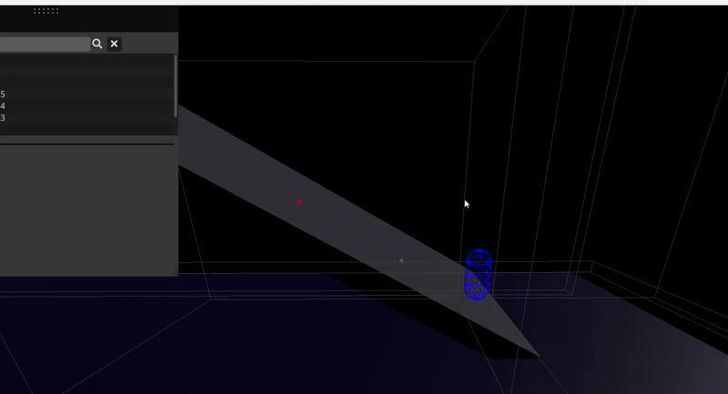

# C++ FPS Engine

#### In this project, my team and I built a first-person shooter (FPS) engine using the Entity-Component-System (ECS) architecture in C++. Here's what I worked on:

**Gun System**  
I designed and built a customizable gun system - this means game designers can add or tweak guns without needing to touch the code! It's flexible and easy to use for non-programmers.

<video width="854" height="480" controls muted>
  <source src="../assets/projects/FPSEngine/newSettingsForGuns.mp4" type="video/mp4">
</video>

**Jolt Physics Integration**  
I integrated Jolt Physics into the engine, adding custom collision handling and fixing tricky physics issues. This made sure things like bullets, characters, and environments interacted smoothly and realistically.

**Character Movement**    
I implemented the player character’s movement system: walking, running, jumping - making sure it feels smooth and responsive.

**Bug Fixing & Checking**    
I spent time hunting down bugs, testing the features we built and making sure everything worked as expected.

**Pull Request Reviews**    
On GitHub, I regularly reviewed my teammates' pull requests (PRs), checking the code for quality, suggesting improvements, and making sure the project stayed on track.

### Final Showcase: 

<video width="854" height="480" controls muted>
  <source src="../assets/projects/FPSEngine/CustomEngine.mp4" type="video/mp4">
</video>

## What I Learned

📝 Agile Planning - I learned how to work with a team using agile methods: breaking down tasks, planning sprints, and adjusting plans based on feedback and progress.

🏗 Engine & System Design - I gained experience designing cross-platform systems and making sure everything integrates smoothly, though I know I still have more to learn in this area!

🤝 Teamwork & QA - I practiced following and improving workflows, like Git pipelines and code reviews, to keep the project stable. I also took part in retrospectives to improve how we worked together.

🚀 Technical Growth - I pushed myself with technically challenging tasks (like physics integration and optimization) and improved my programming skills, especially in C++ and systems thinking.



