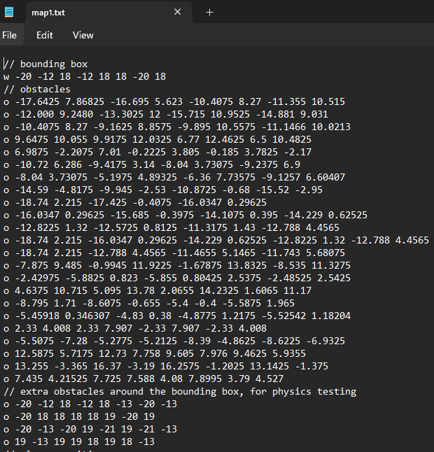
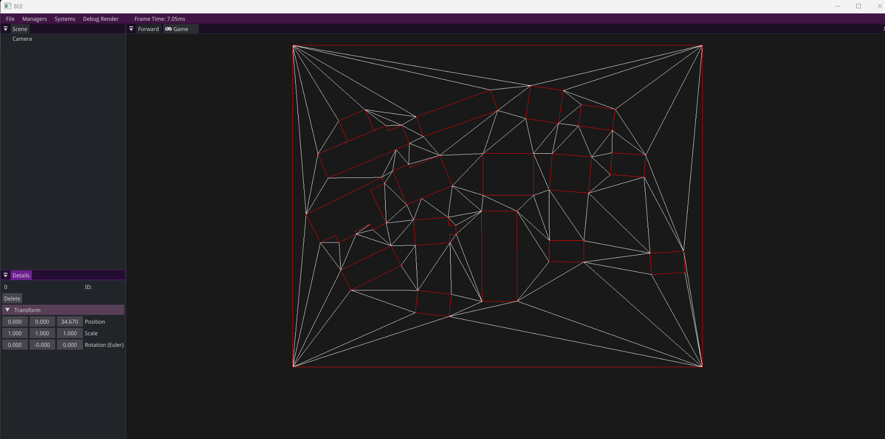
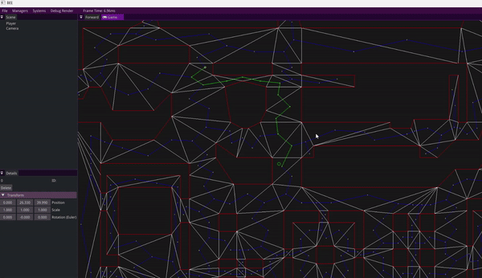
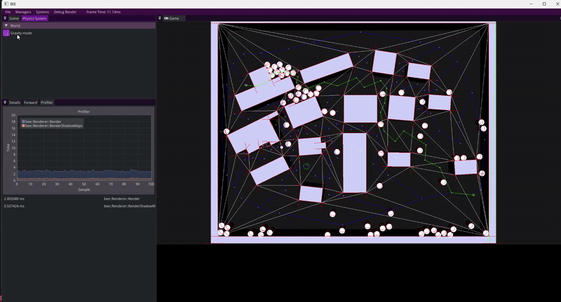
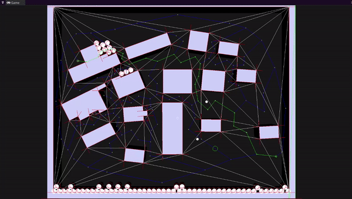

For this project, I built key components of a 2D game engine focused on pathfinding, collision detection, and physics. Even though it was 2D, this work gave me deep insights into the systems behind major engines like Unreal and Unity — showing how much complexity is hidden behind the scenes, even in “simple” games.

### ✨ What I Built

**Graph-Based Pathfinding (Week 1)**
* Implemented A* search algorithm on graph data.
* Built a debug demo showing computed paths on various example graphs.
* Learned how to visualize pathfinding steps and costs.

**Data:** 

 

**Result:** 

**Navigation Meshes (Week 2)**

* Developed functionality for creating triangulated navmeshes.
* Applied A* to navigate across navmeshes.
* Built demos showing accurate pathfinding on complex maps (different maps).

**Game Loop & ECS Integration (Week 3)**

* Integrated pathfinding agents into an Entity Component System (ECS).
* Created a working game loop and AI loop.
* Built a demo where multiple agents chase a player-controlled character and recompute paths dynamically.

**Physics Engine Foundations (Week 4)**
* Added physics system for 2D disks and polygons.
* Implemented static, dynamic, and kinematic body types.
* Set up a fixed-framerate physics loop to ensure consistent simulation.

**Collision Detection & Resolution (Week 5)**
* Developed collision detection for disk-disk and disk-polygon cases.
* Implemented physically accurate collision resolution: agents slide along surfaces, bounce off, and push each other around.
* Built a demo game mode where agents behave like bouncing balls under gravity.

**Combining Physics & Gameplay (Week 6)**
* Extended physics with custom collision handling.
* Added a shooting mechanic: bullets bounce once off walls, then break; hitting an agent destroys both.
* Final demo combines AI, physics, and gameplay into a fun, interactive experience.

### Why This Was Challenging

🔢 Heavy Math & Geometry - I had to deeply understand and implement math-heavy systems, from graph theory (for pathfinding) to geometric algorithms (for collisions).

🛠 Engine-Level Programming - Unlike using an existing game engine, I was building these features from scratch. That gave me firsthand experience with the technical foundations of games.

🎯 Balancing Accuracy & Performance - I needed to keep the system precise (correct paths, accurate collisions) while ensuring it ran smoothly, even with multiple agents and objects interacting at once.

### What I Learned

🔍 Deep Systems Understanding - I now understand how core gameplay systems like pathfinding, collision, and physics work under the hood - not just how to use them, but how to build them.

⚙ Research & Structured Development - This was part of a structured study module where I had to research solutions, define criteria, and deliver specific engine functionalities each week - similar to a real-world sprint cycle.

🧠 Problem-Solving Under Pressure - Some features (especially collision handling and combining physics with gameplay) were much harder than they looked. I learned to break big problems into manageable parts, prioritize, and iterate.

💬 Engine/Gameplay Separation - I practiced keeping engine systems (like pathfinding or physics) cleanly separated from gameplay code - an essential discipline for scalable, maintainable projects.



