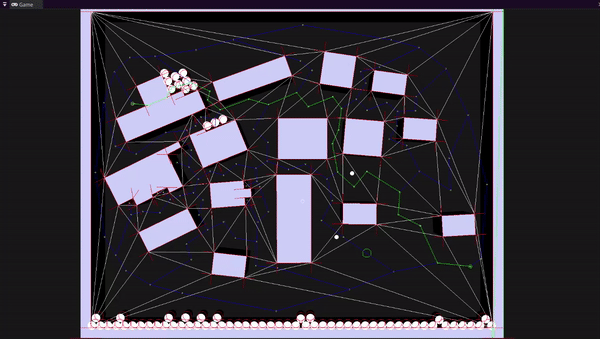
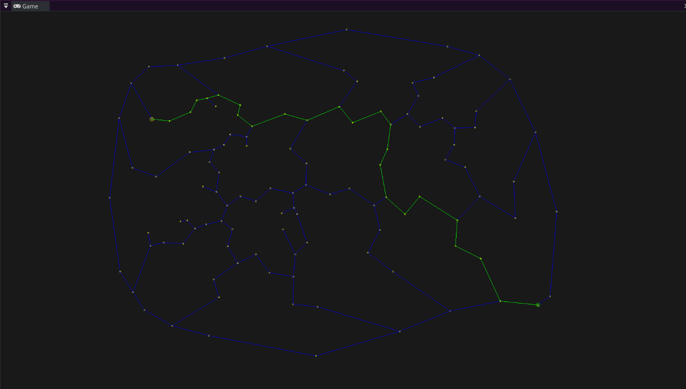
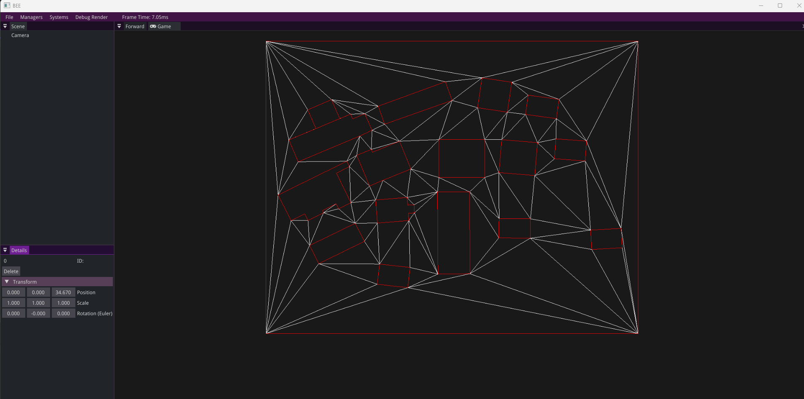
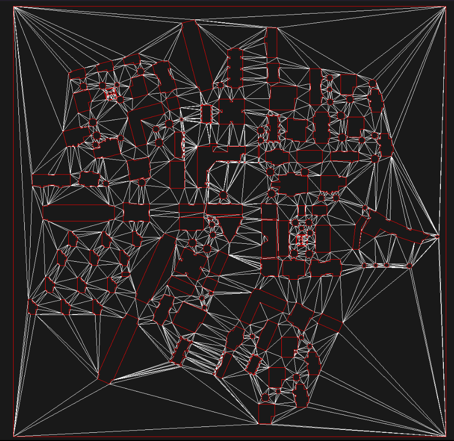
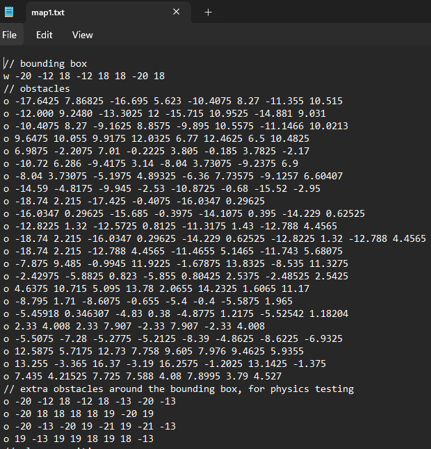
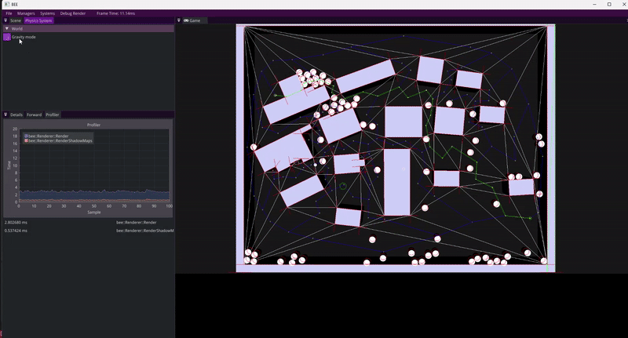

# Pathfinding, Physics & Gameplay - 2D Engine in C++

---

<div class="row">
<div class="col" markdown="1">

We were given a bare-bones engine that could draw lines and manage entities. Everything else: pathfinding, physics, collision, AI, gameplay - had to be built from scratch in C++ over 8 weeks. By the end, all the systems were running together in a playable game where AI agents chase the player and bullets bounce off walls.

| **Type** | **Duration** | **Platform** |
|---|---|---|
| Solo study project | 8 weeks | PC/Windows |

</div>
<div class="col" markdown="1">



</div>
</div>

---

### What did I build?

- A* search algorithm with a custom priority queue on graph data
- Triangulated navigation mesh using Clipper2 subtraction and CDT triangulation
- ECS integration with a fixed-timestep AI loop and look-ahead steering
- Custom 2D physics: static, dynamic, and kinematic bodies
- Circle-circle and circle-polygon collision detection with impulse resolution
- Playable game combining all systems: agents chase player, bullets bounce and destroy on hit

[View source code on GitHub](https://github.com/DanielKocan/2D-Pathfinding-Physics-CPP)

---

## Contents

- [A* Pathfinding on Graphs](#pathfinding)
- [Navigation Mesh](#navmesh)
- [ECS Integration and the AI Loop](#ecs)
- [Physics Engine](#physics)
- [Collision Detection and Resolution](#collision)
- [Putting It All Together](#gameplay)
- [What I Learned](#what-i-learned)

---

## A* Pathfinding on Graphs {#pathfinding}

The first thing I built was A* on a simple graph. Implementing A* algorithm from scratch meant making real decisions: what data structure for the open set, how to track costs, how to reconstruct the path at the end.

I used a min-heap priority queue via `std::priority_queue` with `std::greater` so the lowest f-cost node is always expanded first. The `cost_so_far` map is the key piece that separates A* from basic BFS - it lets me to skip re-exploring nodes which i have already reached more cheaply.

```cpp
// A* core loop - priority queue ensures lowest f-cost node is always expanded first
while (!frontier.empty())
{
    int current = frontier.get();
    if (current == goal) { path = reconstruct_path(start, goal, came_from); break; }

    for (auto& next : graph.neighbors(current))
    {
        float new_cost = cost_so_far[current] + graph.cost(current, next.v);

        // Only explore this node if we found a cheaper path to it
        if (cost_so_far.find(next.v) == cost_so_far.end() || new_cost < cost_so_far[next.v])
        {
            cost_so_far[next.v] = new_cost;
            float priority = new_cost + getHeuristic(next.v, goal); // f = g + h
            frontier.put(next.v, priority);
            came_from[next.v] = current;
        }
    }
}
```



---

## Navigation Mesh {#navmesh}

Running A* on a simple graph works for the demo maps, but games usually use navigation meshes. I built one using three libraries chained together, each solving one part of the problem.

The pipeline: **Clipper2** subtracts the obstacle polygons from the walkable area, giving me the actual walkable space as a polygon. **CDT** (Constrained Delaunay Triangulation) then triangulates that space into triangles. My graph code converts the CDT result into a dual graph where each triangle is a node and shared edges between triangles are connections - then A* from the previous step runs on that graph.

```cpp
NavigationMesh::NavigationMesh(const std::shared_ptr<map>& _map)
{
    // Step 1 - subtract obstacles from walkable area using polygon boolean ops
    std::vector<PathD> walkable = ConvertToClipperData(map->mapData.bBoxPos);
    std::vector<PathD> obstacles = ConvertToClipperData(map->mapData.obstacles);
    solution = Clipper2Lib::Difference(walkable, obstacles, FillRule::NonZero);

    // Step 2 - triangulate the remaining walkable space
    calculateCDT();

    // Step 3 - build a graph from the triangulation, A* runs on this
    mapGraph = std::make_shared<graph>(this->cdt);
}
```

Below are two examples showing the triangulation on different maps:




The map data is loaded from a text file - bounding box, obstacles, agent and player positions: parsed into polygons that the navmesh uses in the next step.



---

## ECS Integration and the AI Loop {#ecs}

The engine we were given used an Entity Component System architecture. An entity is just an ID. Components are pure data. Systems contain the logic and iterate over entities that have the right components.

One decision I made early: components hold no functions. They are data only. The system is what acts on the data. This keeps the architecture consistent and avoids the confusion of logic being split between components and systems.

Creating an agent in the game is just attaching the right components to an entity:

```cpp
auto agentEntity = bee::Engine.ECS().CreateEntity();
bee::Engine.ECS().CreateComponent<bee::Transform>(agentEntity);
bee::Engine.ECS().CreateComponent<bee::NavigationComponent>(agentEntity);
bee::Engine.ECS().CreateComponent<physics::BodyComponent>(agentEntity, startPos);
bee::Engine.ECS().CreateComponent<physics::DiskColliderComponent>(agentEntity, 0.4f);
```

The navigation system runs on a fixed timestep of 10 updates per second and is decoupled from the render framerate. This keeps pathfinding deterministic and avoids unnecessary recalculation every frame. Each agent follows a look-ahead point on their path rather than snapping to waypoints, which gives movement a much more natural feel.

```cpp
// Navigation system header - clean public interface, implementation details hidden
class navigation_system : public bee::System
{
public:
    navigation_system(const std::shared_ptr<map>& _gameMap, const float& fixedFPS = 10.0f);
    void Update(float deltaTime) override;
    void Render() override;

    static void CalculateNewPathForAllAgents(glm::vec2 goalPos);
    static void CalculateNewPathForAgent(entt::entity agentEntity, glm::vec2 goalPos);

private:
    static std::shared_ptr<graph> pGameMapGraph;
    std::shared_ptr<NavigationMesh> pNavMesh;
    float fixedTimeStep = 1.0f / 10.0f;
    float timeAccumulator = 0.0f;
};
```



---

## Physics Engine {#physics}

With pathfinding working, I built a 2D physics engine on top of the same ECS. The physics system runs on its own fixed timestep for stability. Variable delta time produces different simulation results on different machines. The accumulator pattern decouples physics from the render framerate.

I made three body types: **static** (inverseMass = 0, never moves), **dynamic** (fully simulated), and **kinematic** (moves but doesn't respond to forces). I store inverseMass rather than mass directly because almost every physics calculation needs the inverse, and division is expensive to repeat every frame.

Each body has an `applyGravity` flag, so gravity can be enabled or disabled per object. This made it easy to have AI agents that respond to collisions  but don't fall through the floor.

```cpp
// Fixed timestep accumulator - physics runs at a consistent rate regardless of framerate
while (timeAccumulator >= fixedTimeStep)
{
    // Apply gravity
    auto agentView = bee::Engine.ECS().Registry.view<physics::BodyComponent>();
    for (auto [entity, Body] : agentView.each())
    {
        if (Body.bodyType == BodyType::STATIC) continue;
        if (gravityMode && Body.applyGravity) Body.velocity.y -= GRAVITY * fixedTimeStep;
        Body.possition += Body.velocity * fixedTimeStep;
    }

    CollisionDetection();
    ResolveOverlap();
    timeAccumulator -= fixedTimeStep;
}
```


---

## Collision Detection and Resolution {#collision}

I implemented two collision cases: circle-circle and circle-polygon. 

Circle-circle is straightforward: compare distance between centers against the sum of radius. Circle-polygon is more complex: first I need to check if the circle center is inside the polygon using a point-in-polygon test, then I had to find the nearest point on the polygon boundary and compute penetration depth from there.

Resolution uses the **impulse method** with a coefficient of restitution that controls bounciness. Static and dynamic bodies are handled separately, so for example a body with inverseMass of 0 absorbs the full impulse without moving.

```cpp
// Impulse resolution - static vs dynamic handled separately
if (collision.inverseMassOfSecondBody == 0.0f)  // hit a wall or static object
{
    float velocityAlongNormal = glm::dot(Body.velocity, collision.normal);
    if (velocityAlongNormal >= 0) continue; // already separating, skip

    float j = -(1.0f + Body.e) * velocityAlongNormal / Body.inverseMass;
    Body.velocity += j * collision.normal;
}
else  // hit another dynamic body
{
    glm::vec2 relativeVelocity = Body.velocity - SecondBody.velocity;
    float velocityAlongNormal = glm::dot(relativeVelocity, collision.normal);
    if (velocityAlongNormal > 0) continue;

    float totalInverseMass = Body.inverseMass + collision.inverseMassOfSecondBody;
    float j = -(1 + Body.e) * velocityAlongNormal / totalInverseMass;
    Body.velocity      += Body.inverseMass * j * collision.normal;
    SecondBody.velocity -= collision.inverseMassOfSecondBody * j * collision.normal;
}
```

One tricky part was making collision data available to game code without coupling physics to gameplay. I solved it by storing collision results on the `DiskColliderComponent` each frame and clearing them after the physics step. Game code reads the data from the component, because physics never needs to know what the game does with it.

---

## Putting It All Together {#gameplay}

The final demo runs all four systems at once: navmesh pathfinding, ECS agent management, physics simulation, and the gameplay layer on top. Pressing space sends agents toward the player's position. Clicking fires a bullet that bounces off walls and destroys any agent it hits.

The bullet logic lives entirely in the game layer. The physics system just reports collisions. The game decides what to do with them:

```cpp
void game_objects_system::BulletsLogic()
{
    for (auto [entity, DiskCollider, Bullet] : bulletsView.each())
    {
        for (const auto& collision : DiskCollider.collisionData)
        {
            if (collision.collidedId != physics::WALLSID)
            {
                // Bullet hit an agent - destroy both
                bee::Engine.ECS().DeleteEntity(collision.collidedId);
                bee::Engine.ECS().DeleteEntity(entity);
            }
        }
        if (!DiskCollider.collisionData.empty())
        {
            Bullet.numOfBounces -= 1;
            if (Bullet.numOfBounces <= 0) bee::Engine.ECS().DeleteEntity(entity);
        }
    }
}
```

Spawning a bullet is one function call that composes four components onto a new entity - the same pattern used everywhere else in the codebase:

```cpp
void game_objects_system::SpawnBullet(glm::vec2 pos, glm::vec2 direction)
{
    auto bulletEntity = bee::Engine.ECS().CreateEntity();
    bee::Engine.ECS().CreateComponent<bee::Transform>(bulletEntity);
    bee::Engine.ECS().CreateComponent<physics::BodyComponent>(bulletEntity, pos);
    bee::Engine.ECS().CreateComponent<physics::DiskColliderComponent>(bulletEntity, 0.2f);
    bee::Engine.ECS().CreateComponent<game::BulletComponent>(bulletEntity, direction);
    entityBody.velocity = entityBullet.direction * entityBullet.movingSpeed;
}
```


---

## What I Learned {#what-i-learned}

- **Building A* yourself is different from using it.** Choosing the right data structure matters as much as the algorithm. Understanding why the priority queue and `cost_so_far` map work together took time, but once it clicked everything else followed.

- **A navmesh is a pipeline, not a single system.** Clipper2, CDT, and the dual graph conversion are three separate problems. Getting the interfaces between them clean was way harder than I initially expected.

- **Fixed-timestep simulation is non-negotiable for physics.** Variable delta time produces different results on different machines. The accumulator pattern was the solution.

- **Impulse resolution math is sensitive.** Small errors in normal direction or penetration depth compound across frames. The physics layer needs to be numerically stable, not just logically correct.

- **Keeping gameplay out of engine systems pays off immediately.** The bullet bounce logic reads collision data from a component and acts on it. The physics system never needs to know what a bullet is. That boundary made debugging both layers much easier.

- **ECS made more sense after building on top of it.** The order-independent, cache-friendly nature of it was confusing at first. By the end I found it more natural than OOP for this kind of problem: being able to give any entity any combination of components and have systems just work is genuinely powerful.

<p class="text-center">

</p>

