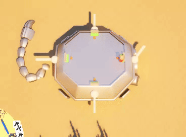

# Wasteland Walkers (Unreal Engine Team Project, 8 Weeks)

For this project, I collaborated with a multidisciplinary team of designers and visual artists to develop an Unreal Engine game over eight weeks. We followed Agile/Scrum processes, adapting flexibly to meet evolving goals and deliver a polished playable experience under tight deadlines.


### [LINK TO WASTELAND WALKERS](https://buas.itch.io/team-mace)

# ✨ My Key Contributions
### ✅ Gameplay Programming

Worked extensively in Blueprints and C++ to implement key gameplay features:

* Moving walker and local co-op up to 4 players.   

* Collision handling and interaction logic.
* Functional minimap system.  

* Turrets and shooting mechanics (guns, ammo, hit detection).   

* Bug fixes, performance tweaks, and system improvements.
* Created new Blueprints and extended functionality via C++ when more control or performance was needed.

### ✅ Agile & Scrum Process

* Participated in regular standups, sprint planning, and sprint reviews.
* Adjusted my work dynamically based on team feedback and shifting design priorities.
* Documented progress and shared updates to keep the team aligned.

### ✅ Dynamic Difficulty Adjustment (DDA) System

* Researched DDA methods as part of my personal development goal.
* Designed and implemented an easy-to-use tool that adjusts game difficulty in real time, enhancing player engagement and balancing challenge.

### 🔥 Why This Was Challenging

⏳ Tight Team Deadlines — With only 8 weeks and a multi-role team, clear communication and fast iteration were essential. I had to stay adaptable and proactive, prioritizing tasks that unblocked others and contributed to the core game experience.

🛠 Balancing Blueprint and C++ — Knowing when to use Blueprints for speed and flexibility vs. C++ for power and efficiency was key. I improved my hybrid development skills significantly.

🎯 Making Systems Designer-Friendly — My DDA tool wasn’t just functional — it was built to be usable by designers without needing code changes, which required thoughtful UI and clear integration.

### ✅ What I Learned

🤝 Effective Team Collaboration — I strengthened my communication, teamwork, and Agile practice, learning how to sync with designers, artists and other programmers smoothly.

🧠 Feature Ownership & Research — Taking ownership of a feature like DDA meant going beyond coding: I researched best practices, tested designs, gathered feedback and iterated to deliver something meaningful to the game.

🔧 Problem-Solving Across Systems — From AI to UI, I worked across diverse gameplay systems, improving my debugging, system design and integration skills.



