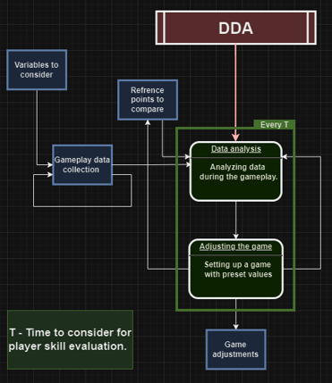
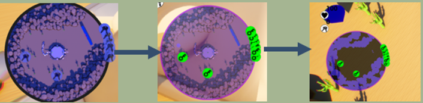
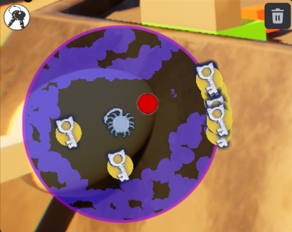
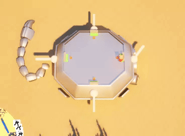
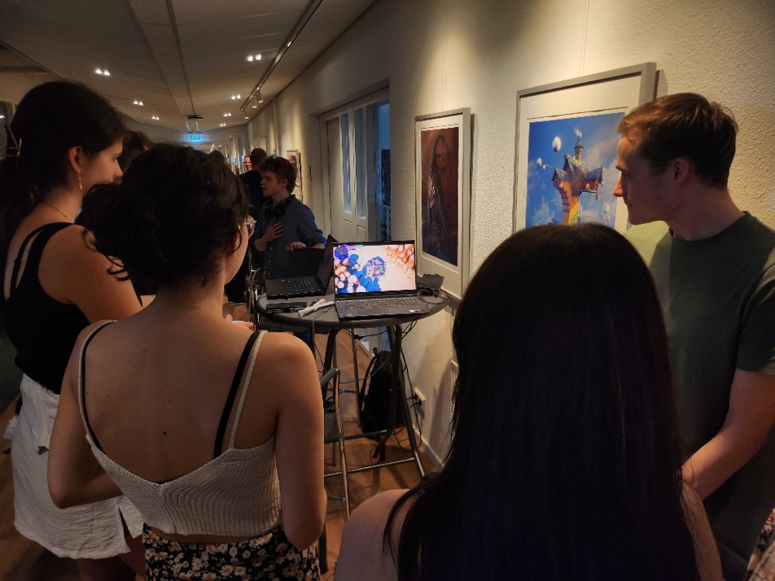

# Gameplay & DDA Programming - Wasteland Walkers

---

A 4-player local co-op game built in Unreal Engine over 8 weeks with a multidisciplinary team of programmers, designers, and visual artists. Players control a giant walking machine across a wasteland, manning turrets and managing systems to survive. My focus was gameplay programming and a dynamic difficulty system I researched and built from scratch.

| **Team size** | **Duration** | **Engine** |
|---|---|---|
| 13 people | 8 weeks | Unreal Engine 5 |

[Play on itch.io](https://buas.itch.io/team-mace)



---

### What did I do?

- Dynamic Difficulty Adjustment (DDA) system - researched, designed, and implemented from scratch with a designer-facing interface
- Minimap system with dynamic enemy icons, camera shake, and health bar UI
- Turrets and shooting mechanics including guns, ammo, and hit detection
- Co-op collision and interaction logic for up to 4 players
- Walker movement system and controller connection/disconnection handling
- Bug fixes and performance improvements across multiple systems

---

## Contents

- [Dynamic Difficulty Adjustment](#dda)
- [Minimap System](#minimap)
- [Gameplay Systems](#gameplay)
- [Working Across Disciplines](#collaboration)
- [What I Learned](#what-i-learned)

---

## Dynamic Difficulty Adjustment {#dda}

The DDA system was my personal development goal for this project. I wanted to go beyond just implementing a feature - I wanted to understand the problem properly first.

I started with research into how DDA is done in real games. The core idea: instead of static difficulty settings, the game continuously measures player performance and adjusts in real time. Every T seconds the system collects gameplay data, compares it against reference points, and makes small adjustments to keep the game in the right challenge zone.

The tricky part was choosing what to measure. I settled on a skill index based on player performance metrics - things like accuracy, damage taken, and survival time. The system maps that index to difficulty adjustments like enemy spawn rates and health values. Each index level has preset values the designer can configure, so tuning doesn't require code changes.

Getting it into Unreal was a separate challenge. Blueprints don't expose the same level of control as C++ for something like this, so I built the core logic in C++ and exposed a clean interface to Blueprints that designers could use without touching the implementation. The DDA settings panel in-editor let the team tune the difficulty curve during the final sprint without needing me to recompile anything.

The video below shows the walker gameplay - the DDA system is running in the background, adjusting enemy spawn counts based on how well the players are doing. If the team is struggling, fewer enemies spawn to keep the game from feeling impossible. If they're doing well, more enemies appear to maintain the challenge. It's subtle by design: good DDA shouldn't be noticeable.

<video width="854" height="480" controls muted>
  <source src="../assets/projects/WastelandWalkers/SpawnerIsWorking.mp4" type="video/mp4">
</video>

[Download full DDA research document](../assets/projects/WastelandWalkers/DDA%20Research.docx)

In practice I also learned that testing DDA properly is hard with only two players. With a small test group the sample size is too small for the adjustments to feel meaningful. That's something I'd address differently next time - either a larger playtest group or a simulation mode that generates synthetic performance data.

---

## Minimap System {#minimap}

The minimap went through several iterations. The first version was functional but basic: just a render target showing the walker from above. From there I added enemy icons that appear and disappear as enemies enter and leave the visible area, a camera shake effect when taking damage, and a health bar that updates in real time.

The evolution happened through feedback loops with the team. I'd share a new version in Discord, collect responses from programmers and designers, incorporate the feedback, then share again. By the time it reached the final version it had gone through multiple rounds of that cycle.

Final version:

One collaboration I'm happy with: a visual artist on the team created custom minimap icons, and I integrated them into the system so they'd display correctly at the right scale and position. Neither of us could have done both parts - team work makes dream work!

---

## Gameplay Systems {#gameplay}

Beyond DDA and the minimap, I worked across several other gameplay systems.

The turret and shooting system handles gun attachment, ammo tracking, and hit detection. I implemented it in a mix of Blueprints and C++. Blueprints for the parts designers needed to configure, C++ for the logic that needed to be fast or reusable. Knowing when to use each was something I got better at across the 8 weeks.

The co-op collision and walker movement system supports up to 4 local players. Controller connection and disconnection had to be handled cleanly so a player dropping out mid-game didn't break the session. The collision logic on the walker itself needed careful tuning so players didn't clip through each other or get stuck on geometry.

End version:

<video width="854" height="480" controls muted>
  <source src="../assets/projects/WastelandWalkers/EndVersionOfWalker.mp4" type="video/mp4">
</video>

---

## Working Across Disciplines {#collaboration}

Most of my features touched other disciplines directly. The minimap needed artist-made icons. The DDA system needed designer input on what the difficulty curve should feel like. The turrets needed to match what the level designers had built around them.

My workflow for keeping that collaboration functional: build something, share it early, collect feedback from whoever it affects, improve it, share again. The screenshot below is from one of those feedback cycles in Discord - the conversation shaped how the final feature turned out.

We followed Scrum throughout the project - weekly sprints, daily standups, sprint reviews and retrospectives. Each task had a clear description, priority, and definition of done before anyone started working on it. I tracked my own tasks on the kanbanflow board and adjusted priorities sprint by sprint based on what the team needed most. A few times that meant  deprioritizing something I was working on to unblock a designer or help with an integration that was holding up another feature.

The biggest collaboration lesson from this project was that sharing something half-finished is better than sharing something late. Getting feedback early, even when it means reworking things, saves much more time than polishing something in the wrong direction.

---

## What I Learned {#what-i-learned}

- **Research before building pays off for complex features.** The DDA system could have been a simple difficulty slider. Understanding the actual problem - continuous player evaluation, reference points, adjustment intervals - led to something genuinely more useful.

- **Designer-friendly tools are a feature, not an afterthought.** If the DDA values could only be changed in code, the team wouldn't have been able to tune the game in the final sprint. Exposing a clean interface to Blueprints was as important as the system itself.

- **Feedback cycles are the fastest way to improve a feature.** Every round of sharing the minimap and collecting responses produced a better result than I would have reached working in isolation.



