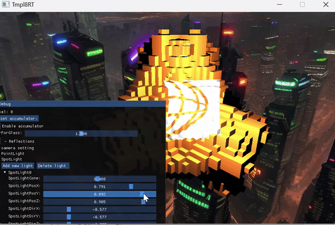
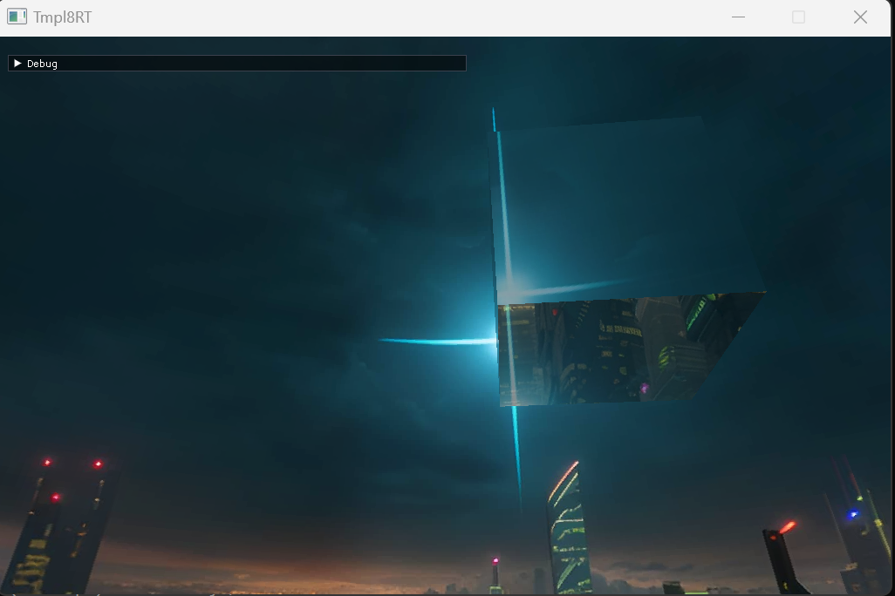
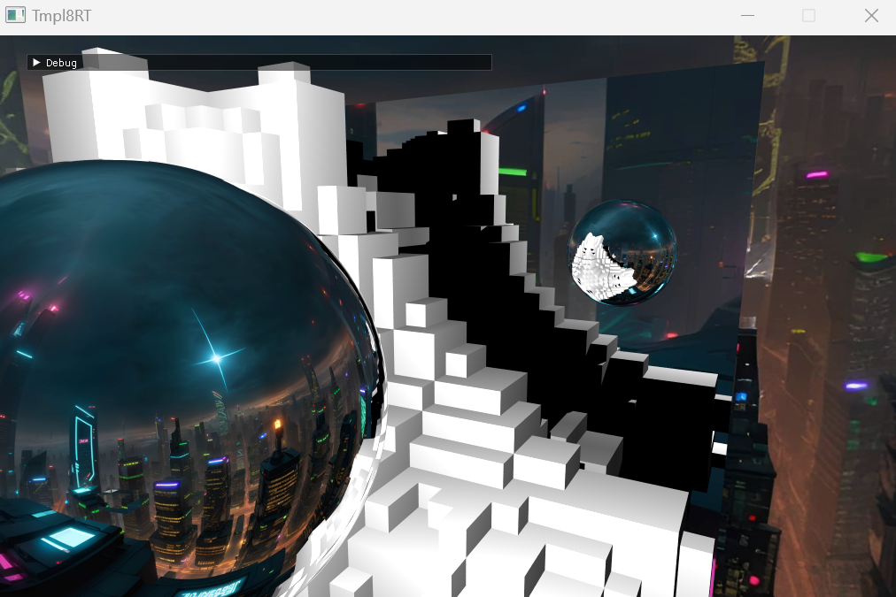
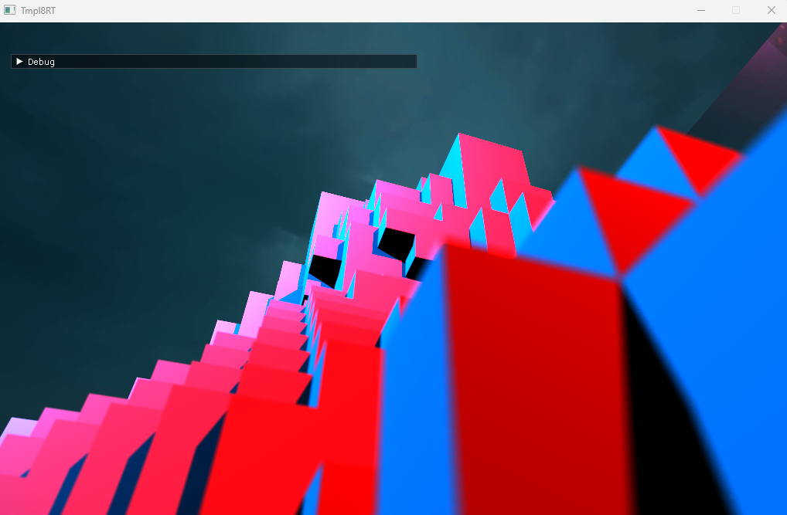
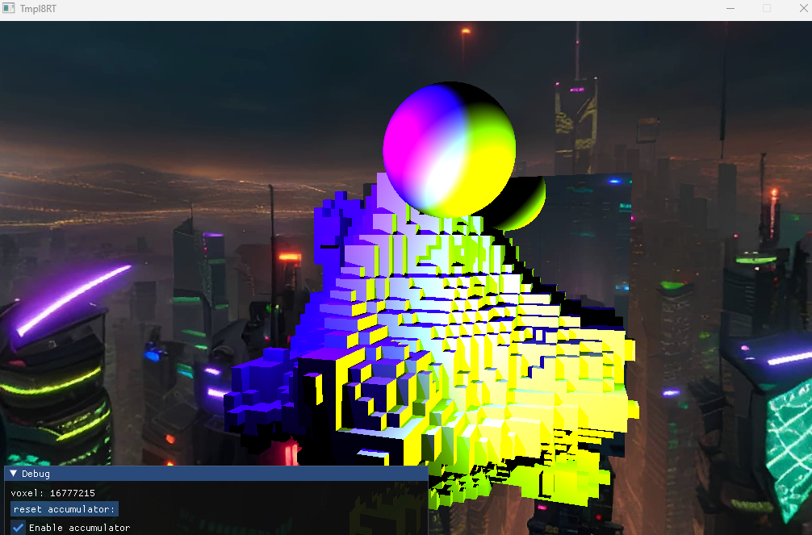
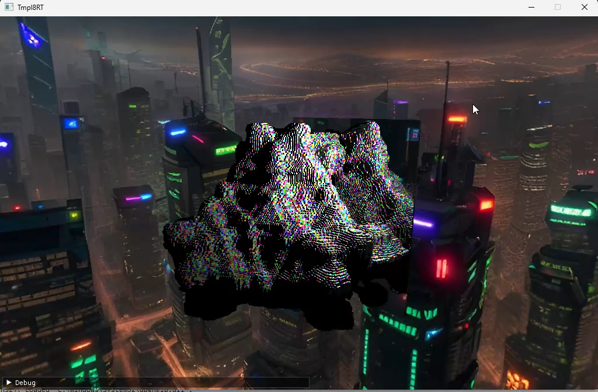
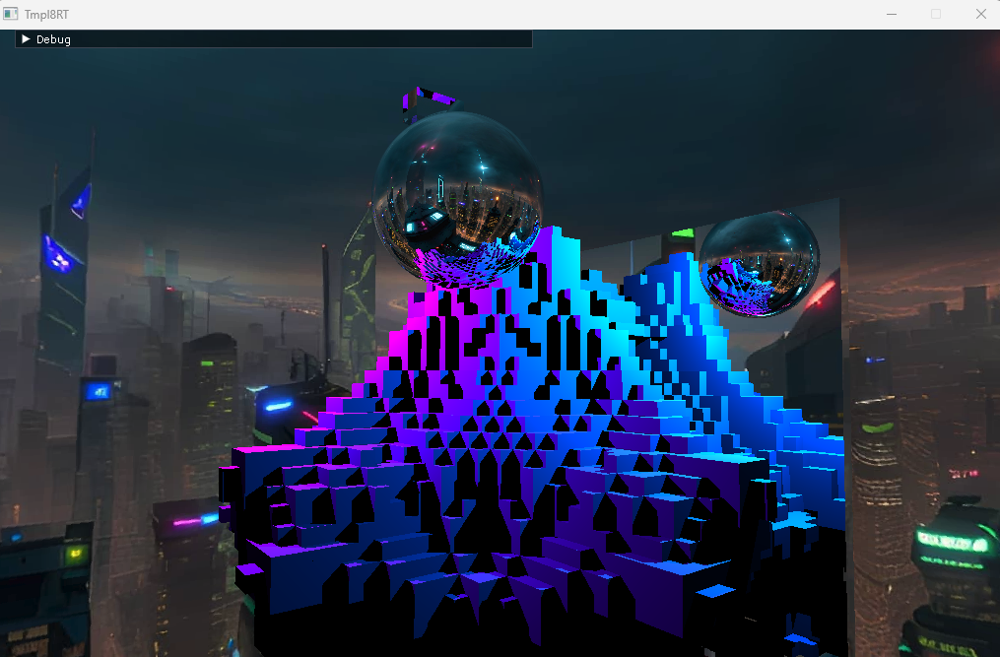
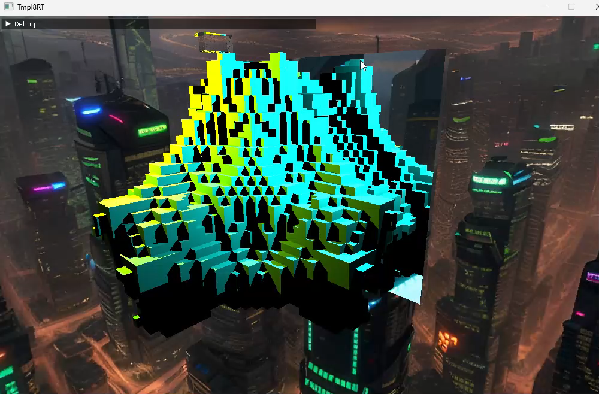

# Voxel Raytracing Engine + Paintball Game  
#### In this challenging graphics and physics programming module, I developed a voxel-based raytracing engine in C++ - and as a creative extension, I turned it into a playable paintball game!

✨ Key Features I Built   
✅ Advanced Lighting & Shadows

* Added point lights, spotlights, and directional lights, all casting realistic shadows using shadow rays.
* Implemented efficient light visibility testing to enhance scene realism.

✅ Material System

* Developed a robust material framework: reflective surfaces, recursive reflections (with recursion caps), and physically accurate dielectric (glass-like) materials.

✅ Anti-Aliasing & Camera Improvements

* Replaced the simple pinhole camera with a camera supporting an aperture, significantly improving image quality through basic anti-aliasing.

✅ New Primitives & Scene Elements

* Added sphere primitives.
* Added a skydome for a satisfying environmental backdrop.

✅ Creative Expansion: Pinball Game

* Leveraged the raytracing engine to develop a fun pinball game where players can play pinballs in voxel environment, blending graphics programming with gameplay mechanics.   

✅ Performance Profiling & Optimization

* Profiled the raytracer to identify bottlenecks and applied targeted optimizations for faster rendering.

More pictures:   

### 💡 What I Learned
This project deeply strengthened my understanding of:
* Recursive algorithms (especially in reflections)
* Light transport and shadow calculation
* Materials and surface interaction models
* Performance profiling and optimization strategies
* Combining visual engines with interactive physics and gameplay systems

It was a demanding but incredibly rewarding project where I bridged graphics theory with hands-on game creation :)



