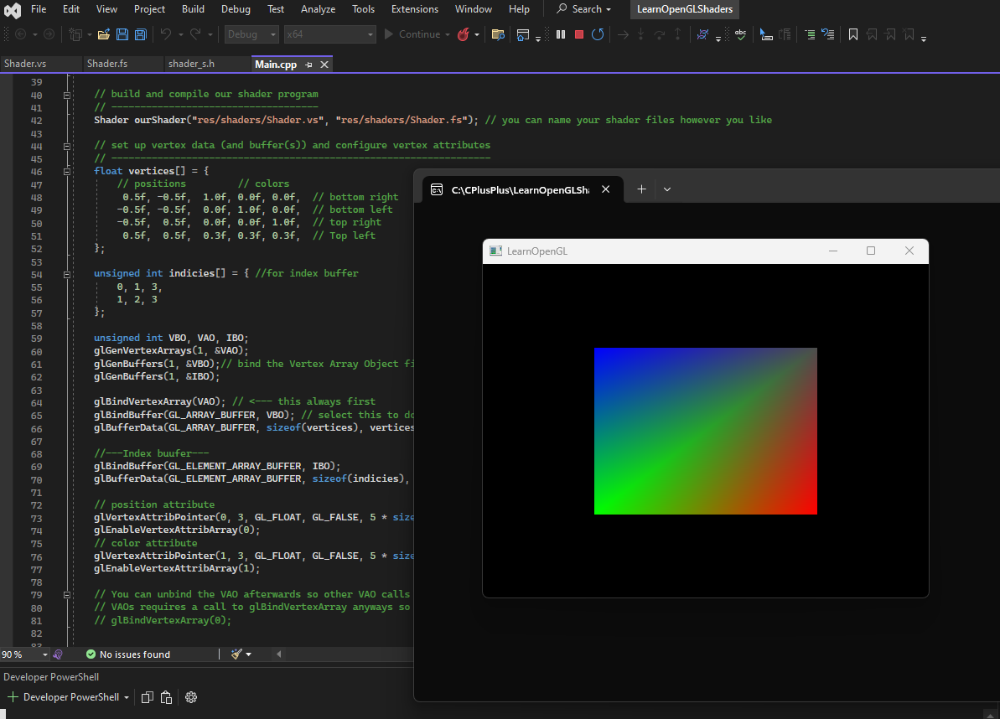
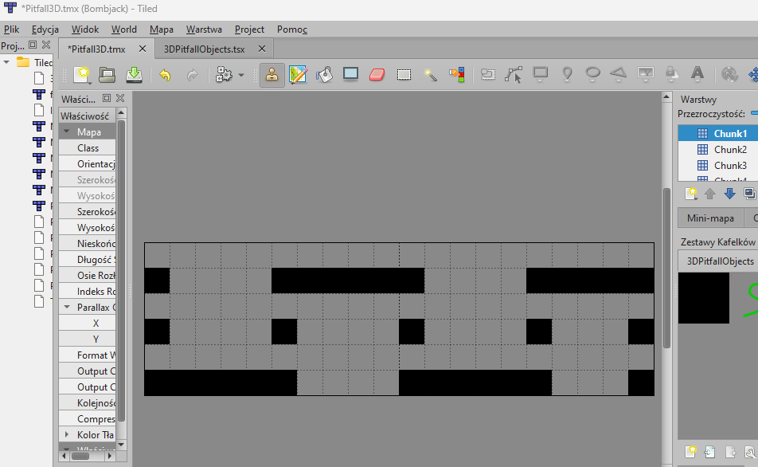
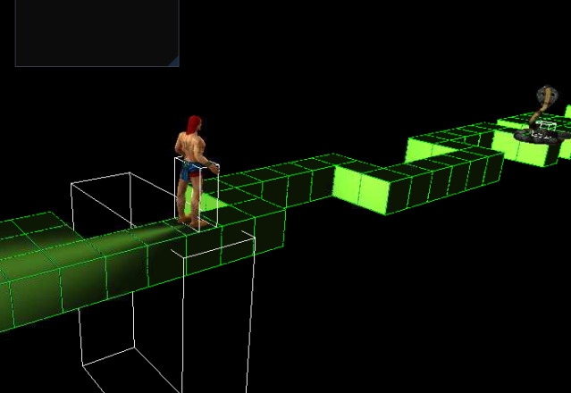

# 🍓 Raspberry Pi 3D Runner
For this project, I developed a 3D runner game on Raspberry Pi, inspired by the classic Pitfall!, using C++, OpenGL for rendering, and Bullet Physics for realistic simulation.
This was a hardware-constrained project, so I had to optimize performance carefully.

# ✨ Core Features I Built
### Physics-Driven World

* Set up a full Bullet physics world, populating it with rigid bodies and managing physical interactions.
* Created accurate collision detection and response systems.

### Rendering Pipeline

* Integrated OpenGL shaders, camera systems, and lighting to display the game world.
* Extracted physics data from Bullet and used it to render debug and gameplay visuals.

### Custom Models & World

* Loaded and displayed OBJ models, turning them into active physics shapes.
* Built a tile-based map system to lay out the runner’s environment.

### Player & Enemies

* Implemented player controls with applied physics forces, carefully tuning for responsive gameplay.
* Created a system of enemies using object-oriented programming, supporting multiple NPCs.

### UI & Menus

* Added in-game menus.
* Used Dear ImGui for real-time debug information and output.

### Final Touches

* Polished the game with sound integration, shader effects, and optimized configurations for Raspberry Pi hardware limits.

# 💡 What I Learned
This project gave me hands-on experience with:

* Low-level graphics programming using OpenGL
* Integrating physics libraries like Bullet into custom project
* Managing hardware constraints (Raspberry Pi)
* Designing gameplay systems tightly connected to physics
* Building interactive UIs and debug tools

It was an excellent exercise in combining engine-level development with gameplay design on embedded systems.



