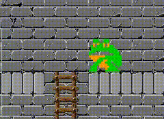
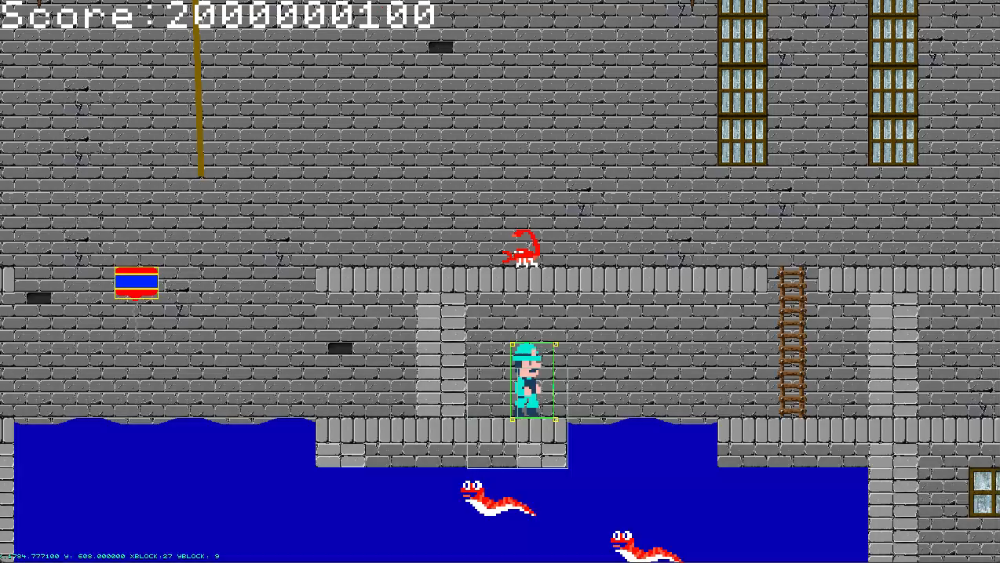

# Pitfall 2D - Platformer Game (C++ from Scratch)
This project was my first project at BUAS and a personal deep dive into building a 2D platformer game entirely from scratch in C++ - no game engine, no shortcuts, just raw code and systems I designed and implemented myself. Inspired by the classic Pitfall!, I set out to recreate the feel and challenges of the original while learning how to construct every system by hand.

# ✨ Core Features I Built
### Custom Rendering System

* Designed a tile-based map renderer to load and display levels using data from Tiled.
* Wrote all rendering logic directly in C++ without relying on a prebuilt engine.

### Player Mechanics

* Developed a fully controllable player with smooth movement, jumping, climbing ladders, and logic for swimming

### World Interaction

* Integrated dynamic objects like ropes, balloons and ladders.
* Designed collision detection systems from scratch to handle interactions between the player, environment and enemies.

### Enemies & Challenges

* Added enemies with simple AI behaviors to challenge the player.
* Introduced collectable items that reward exploration and increase the player’s score.

### Game Loop & UI

* Built the entire game loop and state management system in C++.
* Added a scoring system, a title screen and an end-screen to make the game feel complete.

# 💡 What I Learned
This was one of my most valuable learning experiences because:

* I built all core systems myself: rendering from Tiled, input, physics, collisions, state management.
* I improved my understanding of math and geometry as applied to 2D games.
* I got hands-on practice with tooling workflows: using Perforce for version control, Visual Studio for development, and Tiled for level design.
* I learned how to manage a full game project solo, from prototype to working product.

Unlike engine-based projects, this one forced me to understand every layer of the game stack, which gave me much deeper insight into how professional engines work under the hood.



