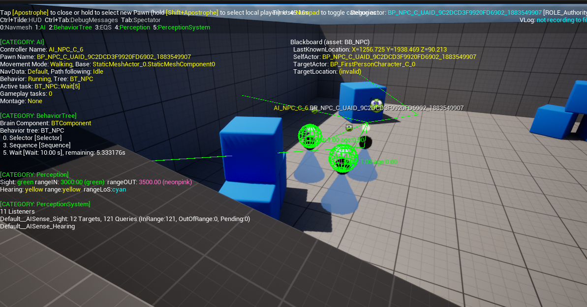
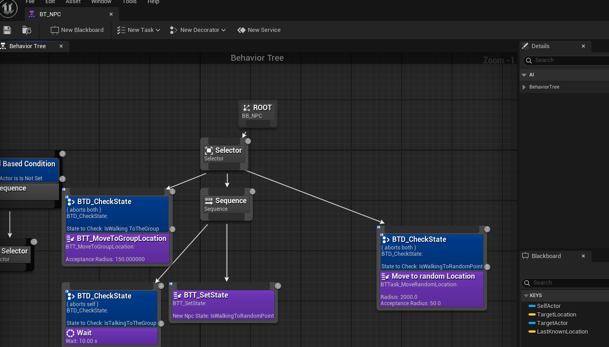
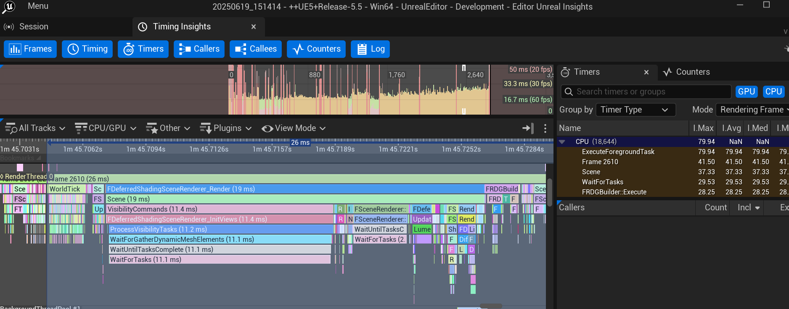
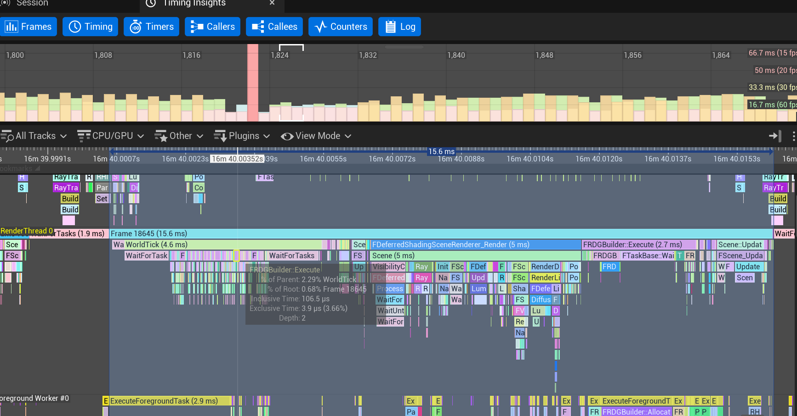

# Sunbeat City (Unreal Engine, Team Project, 6 Weeks)

My main focus was designing and implementing NPC crowd systems, behavior trees, and performance optimization in Unreal Engine. I collaborated closely with designers, visual artists, and other developers to ensure the game’s world felt alive, reactive, and performant.

### Trailer:



### [LINK TO SUNBEAT CITY](https://buas.itch.io/sunbeat-city)

### 🔥 Development 🔥

In the first sprint, I was heavily involved in planning. I actively participated in team discussions, contributed to the scope breakdown, and helped set up collaboration tools such as Discord, Teams, Miro, and Perforce. I also began researching Unreal Engine’s crowd simulation solutions since our early game concept required hundreds of NPCs. 

I experimented with Unreal's Mass AI system, prototyped a basic crowd, and shared results with the team. Even though the system had limited documentation and flexibility, this exploration gave us confidence that large-scale NPCs were possible.

By the second sprint, the focus shifted to prototyping. After further discussions with the designers, we decided to scale down the crowd to around thirty NPCs, which made Behavior Trees and NavMesh a better fit. 

I had never worked with behavior trees before, so this sprint became a huge learning curve. I managed to implement the first working AI, complete with vision cones, hearing, and grouping behavior, allowing NPCs to detect each other and naturally form clusters. 

I also wrote custom decorators and tasks to expand Unreal’s behavior tree system and spent significant time troubleshooting tricky engine quirks, like collision issues and decorator abort bugs.

In sprint three, I expanded on these systems and made them more robust. I introduced the AI Detour Crowd Controller, which improved collision avoidance and gave NPC movement a more natural feel. NPCs were now able to react to the player, smoothly turning to face them instead of snapping, and even showing mood changes when bumped into. I also implemented points of interest and created Blueprint tools that allowed designers to set up NPC behaviors without digging into code. Working closely with other strike teams, I integrated NPC reactions into the Music-to-Movement system so that characters could dance or jump around when the player generated high amounts of music. To add more personality, I included random facial expressions and small details that made the NPCs feel more alive and reactive to the world around them.

The final sprint was focused on polishing features and optimizing performance. I worked with designers to implement a push box mechanic and collaborated with visual artists to add color-based material changes, making NPCs show emotions like anger when bumped into. I also refined the animation system so NPCs could seamlessly transition between idle, talking, and reaction states. 

<video width="640" height="360" controls muted>
  <source src="../assets/projects/SunbeatCity/FinalLook.mp4" type="video/mp4">
</video>

On the technical side, I spent a lot of time profiling and fixing performance issues. Using GPU tracing and NVIDIA Nsight, I tracked down major bottlenecks related to ray tracing, skylight settings, and HZBO configuration. After applying fixes, the game achieved much better framerates and became more stable. I also resolved build failures caused by scalability settings and ensured all improvements were properly committed through Perforce.

Before:

After:

### Sumarize

Overall, my contributions centered on creating a playable, dynamic, and optimized NPC system. From initial research to advanced AI behavior, emotional interactions, and final performance improvements, my work helped for my team to chreate the festival world and feel vibrant & interactive while supporting the needs of other disciplines. This experience allowed me to develop both my technical problem-solving skills and my ability to collaborate effectively across different roles in a game development team.



