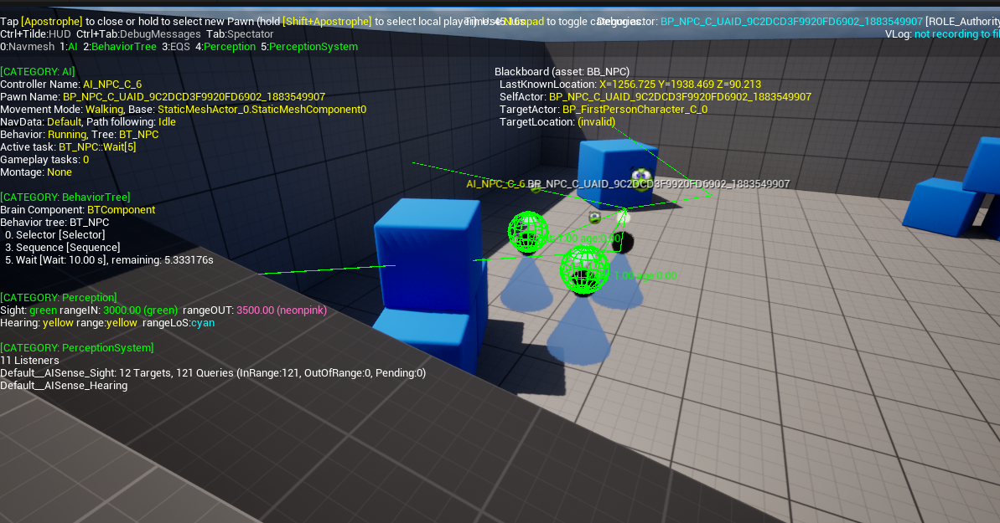
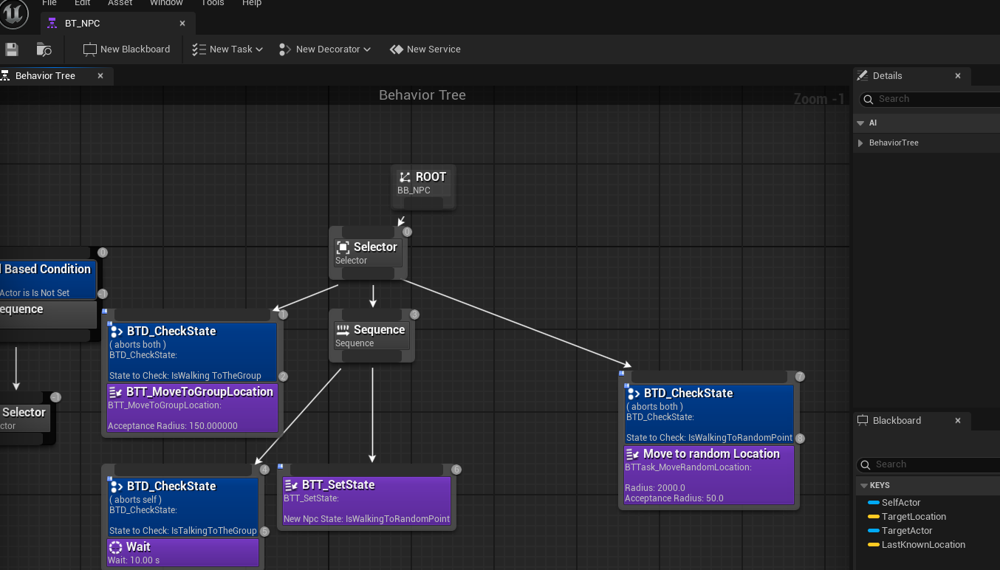
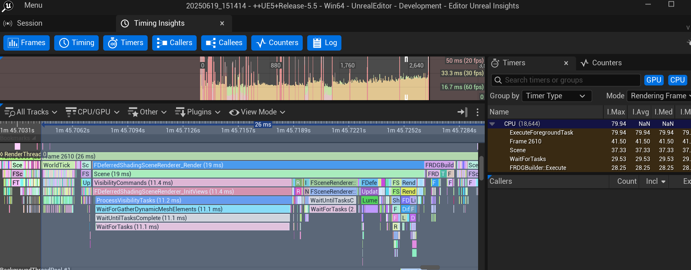
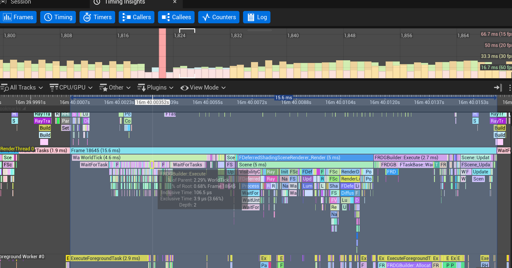

# NPC AI & Performance Programming - Sunbeat City

---

A solarpunk first-person parkour game built in Unreal Engine 5 over 6 weeks with a multidisciplinary team of programmers, designers, and visual artists. My focus was making the world feel alive - designing the NPC crowd system from scratch and squeezing the performance into a playable framerate.

| **Team size** | **Duration** | **Engine** |
|---|---|---|
| 21 people | 6 weeks | UE5 |

[Play on itch.io](https://buas.itch.io/sunbeat-city)



---

### What did I do?

- NPC crowd AI system using Behavior Trees, NavMesh, and UE5 Perception (vision cones, hearing, grouping)
- Researched and prototyped Unreal's Mass AI system before pivoting to Behavior Trees
- AI Detour Crowd Controller for natural collision avoidance between NPCs
- Blueprint tools for designers to configure NPC behavior without code
- Integrated NPCs into the Music-to-Movement system for reactive crowd animations
- Performance profiling with GPU tracing and NVIDIA Nsight - identified and fixed major bottlenecks

---

## Contents

- [Sprint 1 - Research & Mass AI Prototype](#sprint-1)
- [Sprint 2 - Behavior Trees & Perception System](#sprint-2)
- [Sprint 3 - Crowd Personality & Designer Tools](#sprint-3)
- [Sprint 4 - Polish & Performance Optimization](#sprint-4)
- [What I Learned](#what-i-learned)

---

## Sprint 1 - Research & Mass AI Prototype {#sprint-1}

The original concept called for hundreds of NPCs filling a festival crowd. That's not a small number - most games fake it. So before writing a single line of AI logic, I spent the first sprint researching what Unreal actually offered.

I prototyped a basic crowd using Unreal's **Mass AI** system, which is designed exactly for this scale. It worked, but the documentation was thin and the flexibility was limited - configuring individual NPC behaviors or reactions would have required fighting the system rather than using it.

I presented the results to the team with a clear recommendation: Mass AI can hit the numbers, but it can't give us the reactive, personality-driven crowd the designers wanted. That conversation led directly to the Sprint 2 pivot.

---

## Sprint 2 - Behavior Trees & Perception System {#sprint-2}

After discussing with designers, we scaled the crowd down to around thirty NPCs. That made **Behavior Trees and NavMesh** the right call - more control, more expressiveness, and enough documentation to move fast.

I had never built a behavior tree before. Sprint 2 was a steep learning curve.

By the end of it I had the first working AI: NPCs with vision cones and hearing ranges that could detect each other and the player, then naturally cluster into groups. The grouping behavior in particular required custom **decorators and tasks** that extended Unreal's built-in behavior tree nodes - the engine's defaults weren't enough for what the designers wanted.

The hardest bugs in this sprint weren't logic bugs - they were engine quirks. Decorator abort conditions in UE5 behavior trees have some non-obvious timing behavior, and collision between NPCs caused them to stack on top of each other. Both took longer to resolve than the actual feature work.

---

## Sprint 3 - Crowd Personality & Designer Tools {#sprint-3}

With the foundation stable, Sprint 3 was about making the NPCs feel like people rather than navigation agents.

The first addition was the **AI Detour Crowd Controller**, which replaced the default NavMesh movement with something that handles NPC-to-NPC collision avoidance properly. Movement became noticeably more natural - NPCs flowed around each other instead of snapping or jittering.

From there I added layers of personality:

- NPCs smoothly rotate to face the player when nearby, instead of snapping
- Bumping into an NPC triggers a mood change - they show irritation
- Points of interest pull NPCs toward areas of activity
- Random facial expressions fire during idle states to break visual repetition

The integration I'm most proud of in this sprint was connecting NPC behavior to the **Music-to-Movement system** built by another team. When the player generates high amounts of music energy, NPCs break into dancing or start jumping. That required coordinating across two separate systems that were built independently - making sure the interface between them was clean enough that neither team had to understand the other's internals.

I also built **Blueprint tools** that let designers configure NPC behavior - which points of interest they respond to, how sensitive their perception is, what mood states they have - without touching any C++ or behavior tree nodes directly.

---

## Sprint 4 - Polish & Performance Optimization {#sprint-4}

The final sprint had two tracks running in parallel: feature polish and performance rescue.

On the feature side, I worked with designers on a push box mechanic and with visual artists on color-based material changes - NPCs now visually shift color when their mood changes, showing anger as a red tint when bumped. The animation system got a final pass so transitions between idle, talking, and reaction states were seamless.

<video width="854" height="480" controls muted>
  <source src="../assets/projects/SunbeatCity/FinalLook.mp4" type="video/mp4">
</video>

The performance work was more urgent. The game was running poorly and we needed to understand why before we could fix it. I used **GPU tracing inside Unreal** and **NVIDIA Nsight** to profile frame-by-frame and identify the bottlenecks.

The main culprits turned out to be:
- Ray tracing was enabled but not configured correctly for our scene scale
- Skylight settings were causing unnecessary recalculation every frame
- HZBO (Hierarchical Z-Buffer Occlusion) was misconfigured

None of these were obvious from looking at the scene. They only showed up in the profiler. After applying targeted fixes to each, framerates improved significantly and the build became stable enough for the final demo.

**Before optimization:**

**After optimization:**

I also resolved build failures caused by scalability settings that were inconsistent between team members' configurations, and made sure all fixes were committed cleanly through Perforce.

---

## What I Learned {#what-i-learned}

- **Research before committing.** The Mass AI prototype in Sprint 1 felt like lost time in the moment, but it gave the team an informed decision rather than a guess. Knowing why we switched mattered.

- **Engine quirks cost more time than logic bugs.** The decorator abort timing issues and NPC collision stacking weren't things I could reason my way to - they required digging into how Unreal actually executes behavior trees internally. That kind of knowledge only comes from hitting the wall.

- **Profiling is the only honest way to fix performance.** I had guesses about what was slow before I opened Nsight. Most of them were wrong. The actual bottlenecks - skylight recalculation, HZBO config - weren't things I would have found by intuition.

- **Cross-discipline collaboration changes how you design systems.** Building the Blueprint tools for designers forced me to think about API design from the outside in - what does someone who doesn't read C++ need to control, and how do I expose exactly that and nothing more.



