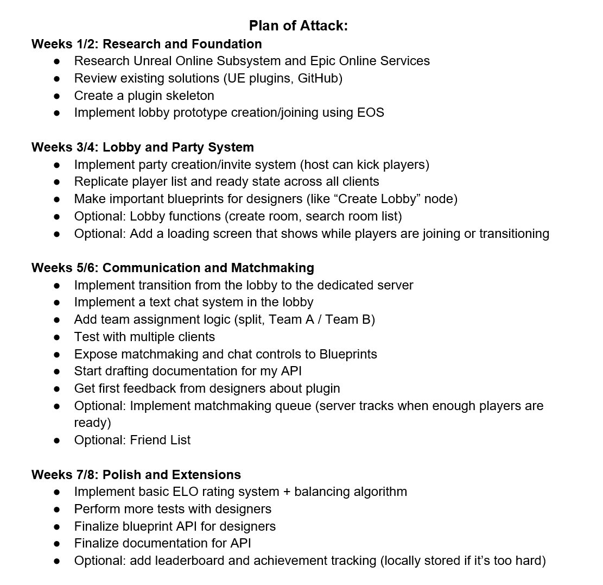
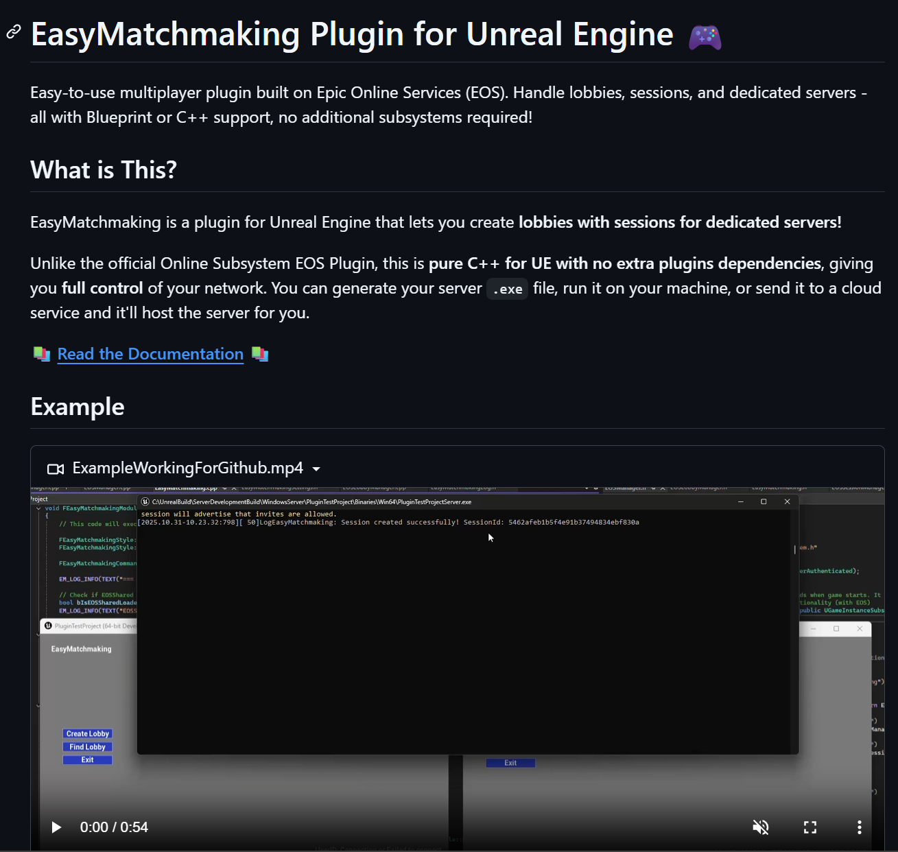

# EasyMatchmaking Plugin (Unreal Engine, Personal Project, 8 Weeks)

A multiplayer networking plugin I built from scratch that makes it easy to create games with dedicated servers. The workflow is simple: players meet in a lobby (peer-to-peer), and when everyone's ready, they automatically transition to your dedicated server. No complex setup, no hidden subsystems - just generate your server .exe, run it, and the plugin handles the rest.

  <iframe src="https://github.com/user-attachments/assets/e076ea9e-18c2-4ef7-ab46-66e94f977b60" frameborder="0" allowfullscreen></iframe>

### [LINK TO GITHUB REPOSITORY](https://github.com/DanielKocan/EasyMatchmaking?tab=readme-ov-file)
       

### 🔥 My Development Journey 🔥

#### Week 1-2: Research & "Why Does This Have to Be So Hard?"

I started this project because there wasn't a simple solution for the workflow I wanted: lobbies that transition to dedicated servers. I wanted players to meet up in a peer-to-peer lobby, chat, ready up, and then automatically connect to a dedicated server when the game starts. This is how most modern multiplayer games work, but implementing it in Unreal Engine was unnecessarily complicated.

So I made a plan. Eight weeks, broken into clear phases. My goal: create a plugin that I wish existed when I started learning multiplayer development.

My key decision: Instead of building on top of the Online Subsystem, I'd create a standalone C++ plugin that talks directly to EOS. No hidden dependencies. Readable code. Full control. And most importantly: a clear workflow from lobby to dedicated server.

The workflow I envisioned:
- Player creates lobby (peer-to-peer via EOS)
- Other players join the lobby (also peer-to-peer)
- Everyone readies up and chats while waiting
- Host clicks "Connect" -> Everyone automatically transitions to your dedicated server
-Game starts on the dedicated server

By the end of week 2, I had a basic prototype - one client could create a lobby, another could join. It was rough, but it worked. That proof-of-concept gave me the confidence to keep going.

<video width="640" height="360" controls muted>
  <source src="../assets/projects/DedicatedServerPluginUE/OutcomeImplementLobbyPrototype2.mp4" type="video/mp4">
</video>

#### Week 3-4: Lobby System
Built the core lobby features: player list synchronization, ready status, kick functionality, and exposed everything to Blueprint.

Network timing was tricky - handling simultaneous joins, disconnects, and keeping state synced across clients took longer than planned. This phase took almost twice my initial estimate, but the foundation needed to be solid.

<video width="640" height="360" controls muted>
  <source src="../assets/projects/DedicatedServerPluginUE/OutcomeAddLobbyHostAndReadyStatus2.mp4" type="video/mp4">
</video>

#### Week 5-6: Dedicated Server Transition
The core feature came together: transitioning from peer-to-peer lobbies to dedicated servers.
You generate a server .exe from Unreal, run it (locally or cloud), then:

Players join lobby and ready up (peer-to-peer)
Host clicks "Connect"
Plugin creates session on your dedicated server
All lobby members auto-connect to the server

Technical challenges: synchronizing the transition timing, broadcasting connection info, handling failures when the server isn't running. Getting 4 clients to seamlessly transition together took extensive debugging.
I also added chat functionality and comprehensive error logging (not in the original plan, but essential for debugging network issues).

<video width="640" height="360" controls muted>
  <source src="../assets/projects/DedicatedServerPluginUE/BigExample.mp4" type="video/mp4">
</video>

#### Week 7-8: Polish & Documentation
Created example UI widgets, wrote setup documentation (how to generate .exe, run servers, handle transitions), and tested across different network conditions.

I cut the planned ELO rating and matchmaking queue to focus on a rock-solid core workflow. Better to do one thing well than many things poorly.

## What Changed From the Original Plan
Throughout development, several aspects of the original plan shifted based on practical realities:

- **Accelerated Features**: Blueprint exposure turned out to be more straightforward than expected, allowing me to complete it earlier and make it more comprehensive than initially planned.   

- **Extended Timeline**: Lobby synchronization and real-time updates required significantly more debugging than anticipated. Network timing issues and EOS callback handling took nearly twice the planned time.

- **Reprioritized Features**: The ELO rating system and matchmaking queue (planned for weeks 7-8) were deprioritized in favor of strengthening core lobby and session functionality. Robust foundation proved more valuable than advanced features.

- **Added Scope**: Error handling and logging wasn't in the original plan as a major feature, but became essential during testing. I added comprehensive logging throughout weeks 5-7.

- **Deferred Optional Features**: Friend list integration and achievement tracking were moved to "future enhancements" to focus on delivering a solid core experience.

This iterative process taught me that initial planning is crucial, but flexibility and responding to real-world constraints is equally important. The final product is stronger for these adjustments.

## Summary

Overall, this project allowed me to deep-dive into networking architecture, understand EOS at a fundamental level, and create a tool that other developers can actually use and learn from. The plugin is designed to be hackable - developers can read the C++ code, understand how it works, and modify it for their specific needs. This transparency was a key goal, as I believe the best way to learn is by reading and experimenting with clear, well-structured code.

The project taught me not just about networking and multiplayer systems, but also about API design, user experience (for developers), and creating maintainable, expandable codebases. I continue to iterate on the plugin based on feedback and new feature requests from the community.

### [LINK TO GITHUB REPOSITORY](https://github.com/DanielKocan/EasyMatchmaking?tab=readme-ov-file)



