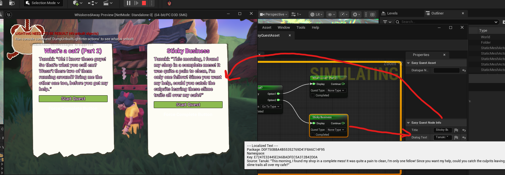
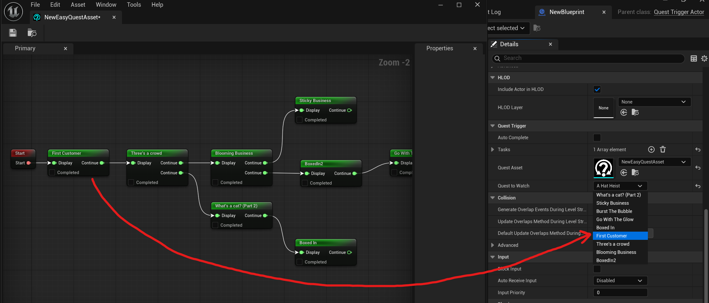
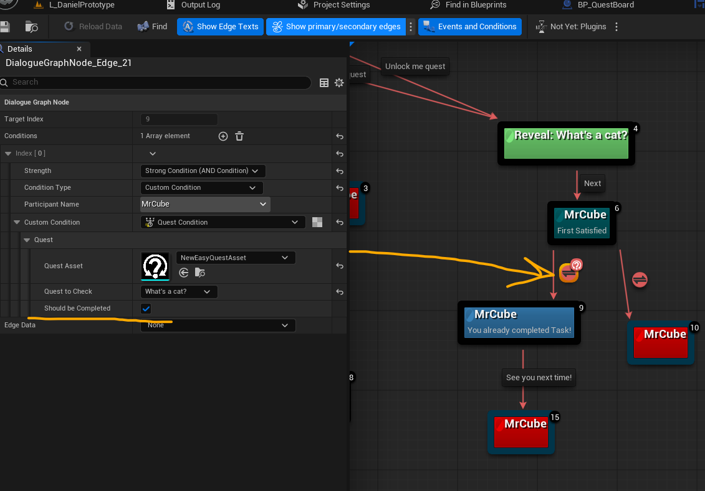
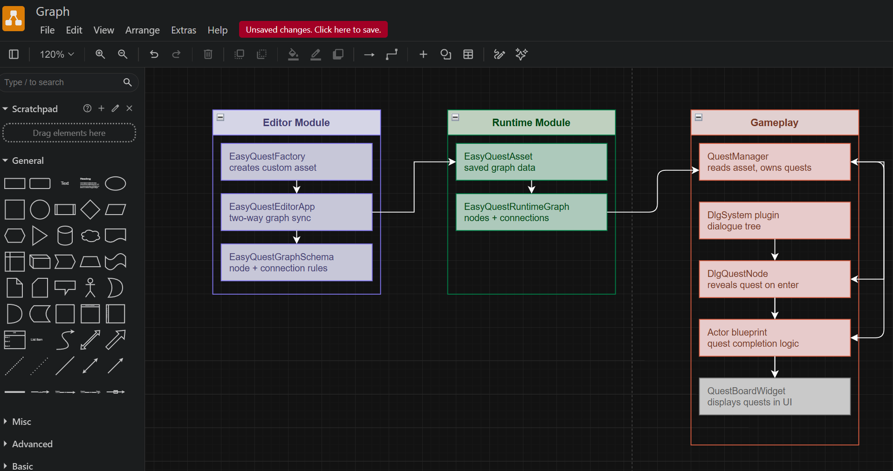
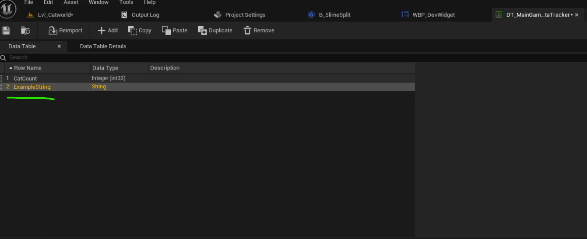
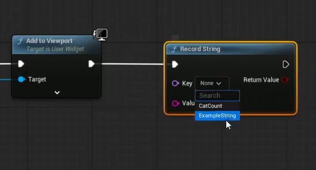
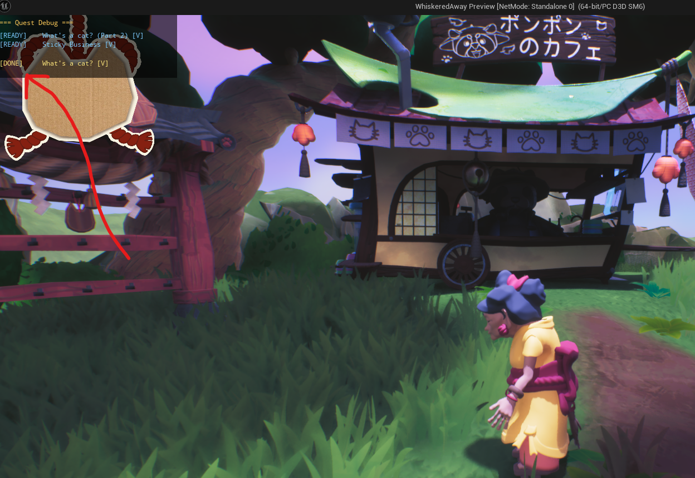

# Quest Graph System
**Unreal Engine 5 · C++ · Team Project · ~4 months (still in development, project to be annoucned soon)**

---

<div class="row align-items-center">
<div class="col-md-6" markdown="1">

I built the quest system for a 22-person student team project. The goal was to give designers full ownership over quest creation - they needed to author quest chains, define dependencies between quests, hook them up to dialogue, and do all of it without writing code or waiting for a programmer. I built the whole pipeline: a custom graph editor, runtime manager, dialogue plugin integration, debug overlays, and save/load.

[View source on GitHub](#)

</div>
<div class="col-md-6" markdown="1">

<video width="100%" controls muted>
  <source src="../assets/projects/QuestSystem/QuestSystemWorks.mp4" type="video/mp4">
</video>

</div>
</div>

---

**Contents**
- [Why a Custom Graph](#why-a-custom-graph)
- [Visual Graph Editor (EasyQuest)](#visual-graph-editor-easyquest)
- [Runtime Loading - Three Passes](#runtime-loading---three-passes)
- [BaseQuest State Machine](#basequest-state-machine)
- [QuestTriggerActor and Designer Workflow](#questtriggeractor-and-designer-workflow)
- [DlgSystem Integration](#dlgsystem-integration)
- [GameDataTracker](#gamedatatracker)
- [Save System](#save-system)
- [Debug Overlays](#debug-overlays)
- [What I Learned](#what-i-learned)

---

## Why a Custom Graph

I needed something where designers could freely create quest nodes with custom data, custom connection rules, and context menu actions like "Add Quest" directly on the node. The graph also needed to save as a custom asset in the Content Browser so designers could create and manage multiple quest graphs themselves.

Because of all this I decided to build a blueprint-style graph from scratch. That gave me full control: custom node types, custom coloured pins, custom save and load logic. Designers are already familiar with how blueprints look, so the learning curve for them was low.

---

## Visual Graph Editor (EasyQuest)

The graph editor is built on top of `FAssetEditorToolkit` and `SGraphEditor`. Double-clicking a `UEasyQuestAsset` in the Content Browser opens a two-panel layout - the graph canvas on the left and a properties panel on the right.

Each node represents one quest. Connections between nodes define dependencies - if Quest B has a connection from Quest A, Quest B stays blocked until Quest A is complete. Designers author the entire quest chain this way with no data tables or config files to maintain manually.

The first thing to set up was a custom asset factory so Unreal knows how to create and store the asset:

```cpp
// EasyQuestFactory.cpp
UObject* UEasyQuestFactory::FactoryCreateNew(
    UClass* uclass, UObject* inParent, FName name,
    EObjectFlags flags, UObject* context, FFeedbackContext* warn)
{
    UEasyQuestAsset* asset = NewObject<UEasyQuestAsset>(inParent, name, flags);
    return asset;
}
```

The asset itself is a `UObject` with a pointer to the runtime graph. It intercepts `PreSave` so the visual graph is serialised into runtime data before the file is written:

```cpp
// UEasyQuestAsset - what gets saved in the Content Browser
UCLASS(BlueprintType)
class EASYQUESTRUNTIME_API UEasyQuestAsset : public UObject
{
    GENERATED_BODY()
public:
    UPROPERTY(EditAnywhere)
    FString DialogueName = TEXT("Enter dialog name here");

    UPROPERTY()
    UEasyQuestRuntimeGraph* Graph = nullptr;

    void SetPreSaveListener(std::function<void()> onPreSaveListener)
        { _onPreSaveListener = onPreSaveListener; }

    virtual void PreSave(FObjectPreSaveContext saveContext) override;

private:
    std::function<void()> _onPreSaveListener = nullptr;
};
```

The editor window is registered through an app mode that defines the two-panel tab layout:

```cpp
// EasyQuestAppMode.cpp
EasyQuestAppMode::EasyQuestAppMode(TSharedPtr<EasyQuestEditorApp> app)
    : FApplicationMode(TEXT("EasyQuestAppMode"))
{
    _tabs.RegisterFactory(MakeShareable(new EasyQuestPrimaryTabFactory(app)));
    _tabs.RegisterFactory(MakeShareable(new EasyQuestPropertiesTabFactory(app)));

    TabLayout = FTabManager::NewLayout("EasyQuestAppMode_Layout_v2")
        ->AddArea(
            FTabManager::NewPrimaryArea()
            ->SetOrientation(Orient_Vertical)
            ->Split(
                FTabManager::NewSplitter()
                ->SetOrientation(Orient_Horizontal)
                ->Split(FTabManager::NewStack()
                    ->SetSizeCoefficient(0.75)
                    ->AddTab(FName(TEXT("EasyQuestPrimaryTab")), ETabState::OpenedTab))
                ->Split(FTabManager::NewStack()
                    ->SetSizeCoefficient(0.25)
                    ->AddTab(FName(TEXT("EasyQuestPropertiesTab")), ETabState::OpenedTab))
            )
        );
}
```

The graph schema controls what connections are allowed. Output pins break their existing connection when re-linked - one quest can only directly unlock one child - but input pins accept multiple parents, so a quest can require several predecessors before it unlocks:

```cpp
// EasyQuestGraphSchema.cpp
const FPinConnectionResponse UEasyQuestGraphSchema::CanCreateConnection(
    const UEdGraphPin* a, const UEdGraphPin* b) const
{
    if (a->Direction == b->Direction)
        return FPinConnectionResponse(CONNECT_RESPONSE_DISALLOW,
            TEXT("Inputs can only connect to outputs"));

    if (a->Direction == EGPD_Output || b->Direction == EGPD_Output)
        return FPinConnectionResponse(CONNECT_RESPONSE_BREAK_OTHERS_A, TEXT(""));

    return FPinConnectionResponse(CONNECT_RESPONSE_MAKE, TEXT(""));
}
```

The editor module registers custom pin and node factories at startup. Each pin type gets its own colour - green for quest connections, red for the start node, blue for end nodes - and each quest node has a "Completed" checkbox rendered directly on its face using a custom `SGraphNode` widget.

One of the trickier parts was understanding how save and reload work. The visual graph and the runtime graph are two completely separate data structures in Unreal. Two functions handle the conversion: `UpdateWorkingAssetFromGraph()` serialises the visual state into runtime data on save, and `UpdateEditorGraphFromWorkingAsset()` rebuilds all the visual nodes from the saved data when you reopen the asset. The node info class is shared between both using `DuplicateObject`, which avoids writing two separate data structures for the same information.



<video width="800" height="500" controls muted>
  <source src="../assets/projects/QuestSystem/GraphWorks.mp4" type="video/mp4">
</video>

---

## Runtime Loading - Three Passes

At game start, `QuestManager::LoadQuestsFromAsset()` reads the asset and instantiates all quest objects. This requires three passes because graph connections point forward - a quest needs to reference other quests that may not exist yet when it is first created.

```cpp
// QuestManager.cpp
void UQuestManager::LoadQuestsFromAsset(UEasyQuestAsset* QuestAsset)
{
    TMap<UEasyQuestRuntimeNode*, UBaseQuest*> NodeToQuestMap;

    // First pass: create all quest objects
    for (UEasyQuestRuntimeNode* Node : QuestAsset->Graph->Nodes)
    {
        if (Node->NodeType == EEasyQuestNodeType::DialogNode)
        {
            UEasyQuestNodeInfo* NodeInfo = Cast<UEasyQuestNodeInfo>(Node->NodeInfo);
            FString QuestName = NodeInfo->Title.IsEmpty() ?
                NodeInfo->QuestDescription.ToString() :
                NodeInfo->Title.ToString();

            UBaseQuest* Quest = CreateQuest(QuestName, QuestDescription, {});
            NodeToQuestMap.Add(Node, Quest);
        }
    }

    // Second pass: wire up dependencies from graph connections
    for (auto& Pair : NodeToQuestMap)
        for (UEasyQuestRuntimePin* OutputPin : Pair.Key->OutputPins)
            for (UEasyQuestRuntimePin* ConnectedPin : OutputPin->Connections)
            {
                UBaseQuest* ChildQuest = NodeToQuestMap.FindRef(ConnectedPin->Parent);
                if (ChildQuest) ChildQuest->AddDependency(Pair.Value);
            }

    // Third pass: set initial states now that all dependencies exist
    for (auto& Pair : NodeToQuestMap)
    {
        UBaseQuest* Quest = Pair.Value;
        Quest->SetState(Quest->DependentQuestsFinished() ?
            EQuestState::Available : EQuestState::Blocked);
    }
}
```

After the three passes, `LoadProgress()` restores any saved state on top of the freshly initialised pool.

---

## BaseQuest State Machine

Each quest is a `UObject` with four states: `Blocked`, `Available`, `Active`, and `Complete`. Transitions are strict. `Enable()` checks dependencies before moving to Active. `Disable()` only works from Active. `Complete()` only works from Active. Invalid calls silently return.

```cpp
// BaseQuest.cpp
void UBaseQuest::Enable()
{
    if (!IsQuestValid()) return;
    if (!CheckStartCondition()) return;

    if (!DependentQuestsFinished())
    {
        if (State != EQuestState::Blocked) State = EQuestState::Blocked;
        return;
    }

    if (State == EQuestState::Blocked || State == EQuestState::Available)
    {
        State = EQuestState::Active;
        EnableEvent.Broadcast(this);
    }
}
```

`CompleteEvent` is a multicast delegate. Anything that cares about a quest completing - the manager, trigger actors, UI - binds to it. The quest never knows who is listening.

`CheckStartCondition` and `CheckEndCondition` are `BlueprintNativeEvent`. They return `true` by default in C++ but can be overridden per quest in Blueprint, which lets designers add custom rules without touching the base class.

---

## QuestTriggerActor and Designer Workflow

Early on we considered having predefined quest types built into the system. We dropped that because every new way of completing a quest would have required a C++ change, and conditional quests with multiple criteria would have been harder to handle. Instead we decided designers write completion conditions themselves in Blueprint inside a `QuestTriggerActor` placed in the level. Each actor watches one quest by name, binds to its delegates in `BeginPlay`, and fires Blueprint events when the quest becomes active or completes.

The actor has an editor-only function that reads the live quest asset at edit time and returns a dropdown of quest names in the Details panel. Designers pick the quest they want to watch without typing anything:

```cpp
// QuestTriggerActor.cpp
#if WITH_EDITOR
TArray<FString> AQuestTriggerActor::GetQuestNameOptions() const
{
    TArray<FString> Options;
    if (!QuestAsset.IsNull())
    {
        UEasyQuestAsset* LoadedAsset = QuestAsset.LoadSynchronous();
        if (LoadedAsset && LoadedAsset->Graph)
            for (UEasyQuestRuntimeNode* Node : LoadedAsset->Graph->Nodes)
                if (Node->NodeType == EEasyQuestNodeType::DialogNode)
                {
                    UEasyQuestNodeInfo* NodeInfo = Cast<UEasyQuestNodeInfo>(Node->NodeInfo);
                    if (NodeInfo)
                        Options.Add(NodeInfo->Title.IsEmpty() ?
                            NodeInfo->QuestDescription.ToString() :
                            NodeInfo->Title.ToString());
                }
    }
    return Options;
}
#endif
```

The actor also owns the tracker update. Designers call `PushTrackerUpdate()` from Blueprint with an array of criteria and a "comeback" message. The manager creates the tracker widget on demand if it does not exist yet.


<video width="800" height="500" controls muted>
  <source src="../assets/projects/QuestSystem/QuestSystemWorks.mp4" type="video/mp4">
</video>

When creating a QuestTriggerActor, you assign which quest it should watch directly in the details panel. The available quests are automatically populated from the graph asset at edit time, so designers just pick from a dropdown - no typing, no typos :)


---

## DlgSystem Integration

The design team wanted quests to be revealed mid-conversation - when a specific dialogue line is reached, a quest should appear on the board. I had to decide whether to build a dialogue system from scratch or use an existing plugin. Given the time available I researched existing options and settled on DlgSystem: it is open source, maintained up to Unreal 5.7, and has shipped in multiple Steam games. Being open source was important because I knew I would need to extend it.

After getting a working prototype I dug into the plugin source code to understand how its node types work internally. I found the selector node, studied how it handles `HandleNodeEnter` and the loop guard, and used the same pattern to add two new types: `UDlgQuestNode` which reveals and optionally activates a quest when a dialogue line is reached, and `UDlgQuestCondition` which lets a dialogue branch check whether a quest is complete.

```cpp
// DlgQuestNode.cpp
bool UDlgQuestNode::HandleNodeEnter(
    UDlgContext& Context,
    TSet<const UDlgNode*> NodesEnteredWithThisStep)
{
    FireNodeEnterEvents(Context);

    // Loop guard - copied from the plugin's own selector node
    if (NodesEnteredWithThisStep.Contains(this)) return false;
    NodesEnteredWithThisStep.Add(this);

    UQuestManager* QM = UGameplayStatics::GetGameInstance(&Context)
        ->GetSubsystem<UQuestManager>();
    if (QM)
    {
        for (UBaseQuest* Quest : QM->GetQuestPool())
        {
            if (Quest && Quest->GetQuestName() == QuestToReveal)
            {
                Quest->SetVisible(true);
                if (bActivateQuest) QM->ActivateQuest(Quest);
                break;
            }
        }
    }

    // Auto-advance like the plugin's selector node
    for (const FDlgEdge& Edge : Children)
        if (Edge.Evaluate(Context, { this }))
            return Context.EnterNode(Edge.TargetIndex, NodesEnteredWithThisStep);

    return false;
}
```

```cpp
// DlgQuestCondition.cpp
bool UDlgQuestCondition::IsConditionMet_Implementation(
    const UDlgContext* Context, const UObject* Participant)
{
    UQuestManager* QM = UGameplayStatics::GetGameInstance(Context)
        ->GetSubsystem<UQuestManager>();
    if (!QM) return false;

    for (UBaseQuest* Quest : QM->GetQuestPool())
        if (Quest && Quest->GetQuestName() == QuestToCheck)
            return Quest->GetState() == EQuestState::Complete == bShouldBeCompleted;

    return false;
}
```

Both types use the same quest name dropdown populated from the live graph asset at edit time - designers never type quest names anywhere in the project.



<video width="800" height="500" controls muted>
  <source src="../assets/projects/QuestSystem/ExpectedBehavior (1).mp4" type="video/mp4">
</video>

Below is the small architecture overview to demonstrate how are things connected together, the graph editor, quest manager, and dialogue system:



---

## GameDataTracker

Quests need to know things about the world - how many cats the player caught, what difficulty is set, which NPC was last spoken to. I built `GameDataTrackerSubsystem`, a `GameInstanceSubsystem` that works as a typed key/value store for session data backed by a DataTable.

All valid keys are defined once in the DataTable with their expected type. Recording with the wrong type or an unknown key logs a warning and returns false. Keys also have C++ constants in `GameDataTrackerKeys.h`. At startup the subsystem cross-checks the DataTable against those constants and logs any mismatches, so nothing slips through silently:

```cpp
// GameDataTrackerSubsystem.cpp
#if !UE_BUILD_SHIPPING
for (const FName& RowName : RowNames)
{
    const bool bHasCppConstant = GameDataTrackerKeys::AllKeys.Contains(RowName);
    if (bHasCppConstant)
        UE_LOG(LogTemp, Log,     TEXT("[BOUND]   '%s' - has C++ constant"), *RowName.ToString());
    else
        UE_LOG(LogTemp, Warning, TEXT("[UNBOUND] '%s' - Blueprint only, no C++ constant"), *RowName.ToString());
}
for (const FName& CppKey : GameDataTrackerKeys::AllKeys)
    if (!RowNames.Contains(CppKey))
        UE_LOG(LogTemp, Error, TEXT("[MISSING] '%s' - has C++ constant but NOT in DataTable!"),
            *CppKey.ToString());
#endif
```

Blueprint code uses a `UGameDataTrackerBPLibrary` wrapper with one-line calls. The key dropdown in those Blueprint nodes is populated from the DataTable at edit time, so designers cannot accidentally use an invalid key.





---

## Save System

`QuestSaveGame` handles all persistence in a single save slot. One save contains quest states (name, `EQuestState`, visibility flag), the active quest name, the full tracker session data, DlgSystem conversation history, and collected collectible IDs (for our game).

```cpp
// QuestSaveGame.cpp
void UQuestSaveGame::Save(UQuestManager* Manager)
{
    // Don't overwrite a valid save with an empty pool -
    // transitioning to the menu level would erase progress otherwise
    if (!Manager || Manager->GetQuestPool().Num() == 0) return;

    UQuestSaveGame* SaveData = Cast<UQuestSaveGame>(
        UGameplayStatics::CreateSaveGameObject(UQuestSaveGame::StaticClass()));

    SaveData->SavedAt = FDateTime::Now();

    for (UBaseQuest* Quest : Manager->GetQuestPool())
    {
        FQuestSaveEntry Entry;
        Entry.QuestName = Quest->GetQuestName();
        Entry.State     = Quest->GetState();
        Entry.bVisible  = Quest->IsVisible();
        SaveData->QuestStates.Add(Entry);
    }

    if (Tracker) SaveData->TrackerData = Tracker->GetAllData();

    // Preserve which dialogue branches the player has already seen
    SaveData->DlgHistory = FDlgMemory::Get().GetHistoryMaps();

    UGameplayStatics::SaveGameToSlot(SaveData, SaveSlotName, UserIndex);
}
```

Saving triggers on every quest completion, on `QuestManager::Deinitialize`, and on the `PreLoadMap` delegate during level transitions. The `PreLoadMap` guard is important - without it, traveling to the main menu calls `Deinitialize` on an empty pool and overwrites a valid save with nothing.

<video width="800" height="500" controls muted>
  <source src="../assets/projects/QuestSystem/WorksSAving.mp4" type="video/mp4">
</video>

---

## Debug Overlays

Both the quest system and the tracker have custom Slate overlays drawn directly into the viewport - no UMG, no Blueprint, no asset dependencies. Both are pure C++ `SLeafWidget` subclasses that use `FSlateDrawElement` to render their content.

The quest overlay sits top-left. It shows all quests grouped by state with colour coding: grey for Blocked, blue for Available, green for Active, gold for Complete, with a `[V]` or `[H]` visibility tag next to each name. The tracker overlay sits top-right and lists every key/value pair currently recorded.

Both start on the first world tick after the viewport is ready - not at subsystem init time, since the viewport does not exist yet at that point - and refresh on a timer. Both are stripped in shipping builds.

I used Slate directly rather than UMG because these overlays needed to live entirely in C++ with no asset dependencies, start before any level loads, and disappear completely in shipping.



---

## What I Learned

**Graph editors in Unreal have a steep entry cost but a good return.** Getting the asset factory, app mode, tab factories, schema, and pin factories working together took time before anything appeared on screen. Once that foundation was in place, adding new node types or changing connection rules was quick. The upfront investment paid for itself for the whole team.

**Saving is harder than the save format.** The serialisation itself was not complex. The hard part was knowing when to save, when not to overwrite, and what to include.

**Reading plugin source code is faster than working around it.** The DlgSystem integration worked because I spent time understanding the plugin internals before writing anything. Once I saw how the selector node worked, adding my own type took an afternoon. Choosing an open source plugin specifically so I could read the source paid off.

**Building for other people changes how you write code.** The quest name dropdowns, the trigger actor, the Blueprint library all came from conversations with designers about what was annoying. Each one took a few extra hours to build. After that, typos and mismatched quest names stopped being a category of bug.